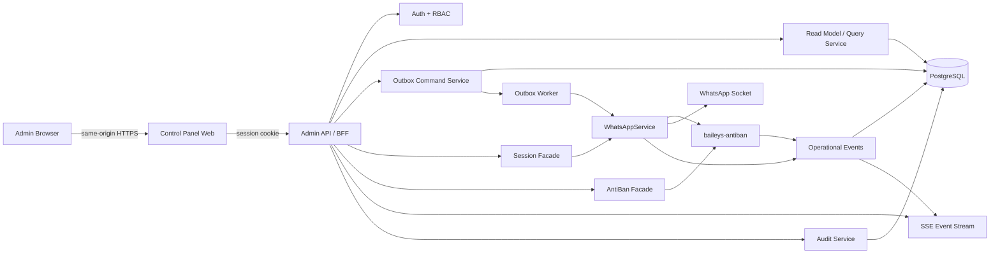

# Blueprint UI Dashboard Control Panel WhatsApp Chatbot

## 0. Status Dokumen

Dokumen ini menerjemahkan temuan pada `CODEBASE_FLOW.md` menjadi rancangan produk dan rencana implementasi dashboard control panel.

Asumsi perencanaan:

- Produk awal mengelola satu session WhatsApp, tetapi struktur data dan route disiapkan agar bisa berkembang menjadi multi-session.
- Dashboard adalah web app internal, desktop-first, dengan fungsi darurat yang tetap dapat dipakai dari mobile.
- Cadence sprint adalah dua minggu, kecuali Sprint 0 selama satu minggu.
- Estimasi mengasumsikan satu frontend engineer, satu backend engineer, satu QA, serta dukungan part-time dari product/design dan DevOps.
- Semua waktu ditampilkan dalam timezone pengguna, default `Asia/Jakarta`; API dan database tetap menggunakan UTC/ISO-8601.

Target rilis:

| Milestone | Cakupan | Target |
|---|---|---:|
| Foundation | Keputusan produk, kontrak API, security baseline, test harness | Akhir Sprint 0 |
| Internal Alpha | Login, shell, overview, status session | Akhir Sprint 2 |
| MVP Operasional | Inbox, contacts, compose, outbox aman | Akhir Sprint 4 |
| Beta | Chatbot rule management dan safety center | Akhir Sprint 6 |
| Production/GA | Queue, alert, audit lengkap, hardening | Akhir Sprint 7 |

---

## 1. Ringkasan Eksekutif

Control panel tidak sebaiknya dibangun hanya sebagai kulit di atas tiga endpoint yang ada. Backend saat ini baru mempunyai:

- `GET /health`;
- `GET /api/whatsapp/status`;
- `POST /api/messages/send`.

Sementara itu, kebutuhan operator mencakup histori percakapan, detail contact, QR, reconnect, outbox, status delivery, statistik anti-ban, pause/resume, audit, dan alert. Karena capability tersebut belum tersedia sebagai API, implementasi harus berjalan dalam dua jalur yang sinkron:

1. **Jalur UI:** app shell, dashboard, inbox, composer, safety center, dan settings.
2. **Jalur platform:** admin API, authentication/RBAC, outbox, canonical identity, event stream, metrics, serta audit log.

Urutan prioritas yang direkomendasikan:

```text
Keamanan dan kontrak
  → observability
  → baca histori
  → pengiriman idempotent
  → pengelolaan chatbot
  → kontrol anti-ban
  → queue/scheduler/fleet
```

Prinsip utamanya adalah **observe before control**. Operator harus dapat melihat alasan sistem menunda atau memblokir pesan sebelum diberi akses untuk mengubah batas atau melakukan reset.

---

## 2. Baseline Codebase dan Dampaknya pada UI

| Temuan codebase | Dampak produk/UI | Respons blueprint |
|---|---|---|
| HTTP server dapat aktif sebelum WhatsApp benar-benar tersambung | Status “service online” tidak boleh disamakan dengan “siap mengirim” | Pisahkan liveness, database health, WhatsApp state, dan send readiness |
| Status WhatsApp hanya `connecting`, `connected`, `disconnected` | Tidak bisa membedakan menunggu QR, retry, logged out, atau bad session | Tambahkan state operasional yang lebih kaya di admin facade |
| QR hanya dicetak ke terminal | Operator non-teknis tidak dapat memasangkan account | Sediakan QR ephemeral melalui event/API terproteksi |
| Database sudah menyimpan `contacts` dan `messages` | Inbox/read model dapat dibangun tanpa mengubah alur incoming dasar | Tambahkan query API, pagination, filter, dan indeks |
| Incoming text disimpan sebelum dibalas dan dideduplikasi | Histori incoming relatif aman dari event ganda | Pertahankan uniqueness provider message ID |
| Hanya text personal chat yang diproses | UI tidak boleh menjanjikan media/group support | Tampilkan tipe unsupported secara eksplisit atau sembunyikan sampai backend siap |
| Kirim ke WhatsApp terjadi sebelum penyimpanan DB | Retry dari UI dapat mengirim pesan dua kali | Bangun outbox + idempotency sebelum compose dinyatakan production-ready |
| Semua send diserialisasi | Pesan tertunda dapat menahan antrean berikutnya | Tampilkan queue age, estimated wait, dan penyebab delay |
| Preset anti-ban `conservative` aktif | Dashboard punya baseline limit yang jelas | Tampilkan penggunaan vs limit, warm-up, health, dan block reason |
| `AntiBan.getStats()`, `pause()`, dan `resume()` tersedia di wrapped socket | Safety Center dapat memakai facade resmi, bukan membaca file state | Tambahkan API adapter dengan RBAC dan audit |
| State anti-ban tersimpan sebagai JSON internal | Mengedit file dari UI berisiko korup/race | File state hanya dibaca library; UI memakai typed service facade |
| JID canonicalizer belum aktif | Satu orang bisa muncul sebagai dua contact | Selesaikan strategi LID/PN sebelum fitur merge/edit contact |
| Chatbot rules masih hardcoded dan menu 3/4 tidak selaras | Editor rule belum bisa langsung menyimpan perubahan | Perbaiki konten lalu pindahkan rules ke storage berversi |
| App belum mempunyai automated tests | Perubahan admin API berisiko merusak send/reconnect | Test harness menjadi gate di Sprint 0 |
| Modul queue/scheduler/webhook/fleet masih opsional | Tidak layak ditampilkan seolah sudah aktif | Gunakan feature flag dan label “belum dikonfigurasi” |

Sumber utama: `CODEBASE_FLOW.md` bagian 1, 3, 5–14, dan 18–20.

---

## 3. Tujuan Produk

### 3.1 Tujuan

- Memberi gambaran kesehatan service, database, session WhatsApp, dan anti-ban dalam kurang dari 30 detik.
- Memungkinkan operator menemukan contact atau percakapan dengan cepat.
- Memungkinkan pengiriman pesan yang idempotent, dapat ditelusuri, dan tidak menghasilkan blind retry.
- Memberi tindakan recovery yang aman, memiliki konfirmasi, permission, dan audit trail.
- Menjelaskan mengapa pesan menunggu, diblokir, gagal, atau terkirim.
- Mengurangi kebutuhan operator membuka terminal, file JSON state, atau log container.

### 3.2 Non-goal MVP

- Campaign/broadcast massal.
- Group management.
- Pengiriman atau preview media.
- CRM lengkap.
- Multi-tenant billing.
- Mengubah semua parameter internal anti-ban secara bebas.
- Mengedit credential/session file secara langsung.
- Menampilkan klaim “delivered/read” sebelum receipt benar-benar dipersist.

### 3.3 Prinsip UX

1. **Status harus dapat ditindaklanjuti.** Setiap kondisi warning/error memiliki penyebab, dampak, dan next action.
2. **Tidak ada optimistic success untuk send.** UI membedakan “diterima sistem”, “dalam antrean”, “terkirim ke provider”, “delivered”, dan “read”.
3. **Risk lebih penting daripada volume.** Health score, pause, timelock, dan recovery selalu terlihat saat bermasalah.
4. **Progressive disclosure.** Operator melihat ringkasan; admin dapat membuka detail teknis.
5. **Dangerous action berfriksi.** Resume pada risk tinggi, reset state, logout, dan hapus session memerlukan step-up confirmation.
6. **Feature honesty.** Modul opsional yang belum aktif tidak menampilkan data palsu atau angka nol yang menyesatkan.

---

## 4. Pengguna, Role, dan Permission

Gunakan permission server-side; role di bawah hanya preset.

### 4.1 Role

| Role | Kebutuhan |
|---|---|
| Viewer | Memantau overview, percakapan, contact, metrics, dan incident |
| Operator | Viewer + mengirim pesan, membatalkan pesan queued, reconnect, dan emergency pause |
| Admin | Operator + resume, reset/re-pair session, mengubah rules/config, user, alert, retention |

### 4.2 Permission Matrix

| Capability | Viewer | Operator | Admin |
|---|:---:|:---:|:---:|
| `dashboard.read` | ✓ | ✓ | ✓ |
| `contacts.read` | ✓ | ✓ | ✓ |
| `messages.read` | ✓ | ✓ | ✓ |
| `messages.send` | – | ✓ | ✓ |
| `messages.cancel` | – | ✓ | ✓ |
| `handoffs.manage` | – | ✓ | ✓ |
| `session.reconnect` | – | ✓ | ✓ |
| `safety.pause` | – | ✓ | ✓ |
| `safety.resume` | – | – | ✓ |
| `session.reset` | – | – | ✓ |
| `chatbot.manage` | – | – | ✓ |
| `safety.configure` | – | – | ✓ |
| `audit.read` | – | – | ✓ |
| `users.manage` | – | – | ✓ |

Catatan:

- Emergency pause dibuat lebih mudah daripada resume karena pause menurunkan risiko.
- Permission wajib diperiksa kembali di backend; menyembunyikan tombol di UI bukan kontrol keamanan.
- Setiap action mutasi menyimpan actor, timestamp, target, before/after, alasan, IP, user agent, dan correlation ID.

---

## 5. Information Architecture

```text
Control Panel
├── Overview
├── Inbox
│   ├── Conversations
│   ├── Follow-up Queue
│   └── Conversation Detail
├── Contacts
│   └── Contact Detail
├── Messages
│   ├── Compose
│   ├── Outbox
│   └── Message Detail
├── Operations
│   ├── WhatsApp Session
│   ├── Safety Center
│   ├── Queue & Scheduler
│   └── Incidents
├── Chatbot
│   ├── Rules
│   ├── Test Console
│   └── Version History
└── Settings
    ├── General
    ├── Users & Roles
    ├── Alerts
    ├── Data Retention
    └── Audit Log
```

### 5.1 Route Map

| Route UI | Page | MVP |
|---|---|:---:|
| `/login` | Authentication | Ya |
| `/overview` | Operational overview | Ya |
| `/inbox` | Conversation list + thread | Ya |
| `/inbox/follow-ups` | Human follow-up queue | Ya |
| `/contacts` | Contact directory | Ya |
| `/contacts/:id` | Contact detail | Ya |
| `/messages/compose` | Safe message composer | Ya |
| `/messages/outbox` | Queue/sending status | Ya |
| `/messages/:id` | Message + event timeline | Ya |
| `/operations/session` | Connection, QR, reconnect | Ya |
| `/operations/safety` | Anti-ban health and control | Beta |
| `/operations/queue` | Queue, dead-letter, scheduler | GA |
| `/operations/incidents` | Operational event timeline | Beta |
| `/chatbot/rules` | Rule editor | Beta |
| `/chatbot/test` | Dry-run chatbot response | Beta |
| `/settings/users` | User and role management | GA |
| `/settings/alerts` | Webhook/notification settings | GA |
| `/settings/audit` | Audit log | GA |

---

## 6. Global App Shell

### 6.1 Desktop Layout

```text
┌────────────────────────────────────────────────────────────────────┐
│ Logo | Environment | Session: Connected | Risk: Low | User menu   │
├───────────────┬────────────────────────────────────────────────────┤
│ Overview      │ Page title                       Last sync 10:42:05 │
│ Inbox         │ ────────────────────────────────────────────────── │
│ Contacts      │                                                    │
│ Messages      │ Main content                                       │
│ Operations    │                                                    │
│ Chatbot       │                                                    │
│ Settings      │                                                    │
├───────────────┴────────────────────────────────────────────────────┤
│ Global incident banner / reconnect state / paused state            │
└────────────────────────────────────────────────────────────────────┘
```

### 6.2 Global Elements

- Environment badge: `Development`, `Staging`, atau `Production`.
- Session status chip: state + label, tidak hanya warna.
- Risk badge: low/medium/high/critical.
- Persistent banner untuk:
  - sending paused;
  - session logged out;
  - QR required;
  - database unavailable;
  - risk high/critical;
  - event stream stale.
- Last sync dan reconnect indicator.
- Command/search box untuk contact, phone, provider message ID, atau internal message ID.
- User menu berisi role aktif, timezone, logout.

---

## 7. Spesifikasi Halaman

## 7.1 Login

Tujuan: membuka session admin tanpa mengekspos `API_KEY` aplikasi ke browser.

Komponen:

- Identifier/email dan credential atau redirect ke OIDC/SSO.
- Error generik agar tidak membocorkan keberadaan user.
- Session expired screen yang mempertahankan intended route.
- Optional MFA/step-up untuk Admin.

Acceptance UX:

- Token/session disimpan pada secure, `HttpOnly`, `SameSite` cookie.
- API key backend tidak pernah dikirim ke JavaScript client dan tidak disimpan di local storage.
- Setelah lima kegagalan beruntun, backend menerapkan throttling.

## 7.2 Overview

Urutan informasi:

1. Incident/risk banner.
2. Readiness cards.
3. Rate-limit and warm-up utilization.
4. Message flow trend.
5. Queue and failure summary.
6. Recent incidents.

Widget:

| Widget | Isi |
|---|---|
| System readiness | HTTP process, database, event stream, last check |
| WhatsApp session | state, uptime, last connect/disconnect, readiness to send |
| Safety score | score 0–100, risk, reasons, recommendation |
| Message flow | incoming/outgoing/blocked/failed per interval |
| Rate utilization | used/limit untuk minute, hour, day |
| Warm-up | day, progress, today sent, today limit |
| Delivery | sent, delivered, delivery rate; hidden if receipt tracking unavailable |
| Outbox | queued, scheduled, retrying, oldest age, dead-letter |
| Follow-up | open, unassigned, overdue, resolved today |
| Recent incidents | severity, event, time, status |

Quick actions:

- Compose message.
- Open QR/pairing.
- Reconnect, jika eligible.
- Emergency pause.
- Open blocked messages.

Data freshness:

- Connection/risk/queue via SSE, fallback polling 10 detik.
- Aggregate charts 30–60 detik.
- “Stale” setelah dua interval tanpa update.

## 7.3 Inbox

Desktop memakai three-pane layout:

```text
┌──────────────────┬──────────────────────────┬──────────────────────┐
│ Search/filter    │ Contact + state          │ Contact detail       │
│ Conversation A   │ Message bubbles          │ Phone/JID identity   │
│ Conversation B   │ Incoming / outgoing      │ Message metrics      │
│ Conversation C   │ Status + timestamps      │ Recent errors        │
│ Cursor loading   │ Composer (permission)    │ Actions              │
└──────────────────┴──────────────────────────┴──────────────────────┘
```

Conversation list:

- Display name, masked/unmasked phone sesuai permission.
- Last message preview dan timestamp.
- Direction icon.
- Last outgoing status.
- Risk/blocked marker jika contact sedang cooldown atau circuit-open.
- Filter: direction, message status, date, has failure, identity warning.
- Cursor pagination; bukan offset untuk feed yang terus berubah.

Thread:

- Bubble incoming/outgoing.
- Timestamp absolut pada detail dan relatif pada list.
- Status timeline: accepted → queued → sending → sent → delivered/read atau failed.
- Provider ID dan internal ID tersedia pada technical details.
- Unsupported message type menampilkan placeholder, bukan bubble kosong.
- Konten sensitif tidak masuk URL, analytics, atau console log.

Composer di thread:

- Permission-aware.
- Character count dan hard limit 4.096.
- Normalisasi line break.
- Disable dengan alasan saat session tidak ready atau sending paused.
- Submit membuat outbox item dan menampilkan ID; tidak langsung mengklaim “sent”.

Follow-up queue:

- Dibuat ketika incoming message cocok dengan rule menu `5` atau rule lain yang memiliki action `create_handoff`.
- State: `open → assigned → resolved`, dengan alternatif `canceled`.
- Menampilkan contact, source message, waktu request, assignee, SLA/due time, dan last interaction.
- Operator dapat claim, assign, menambahkan catatan internal, membuka conversation, dan resolve.
- Source incoming message ID menjadi deduplication key agar replay event tidak membuat task ganda.
- Catatan internal tidak dikirim ke WhatsApp dan harus dibedakan secara visual dari message bubble.

## 7.4 Contacts

Kolom:

- Display name.
- Nomor telepon.
- Canonical identity state: resolved/unresolved/conflict.
- Last interaction.
- Incoming/outgoing count.
- Last outgoing status.
- Created/updated time.

Detail:

- PN JID, LID JID, canonical JID, dan sumber mapping.
- Timeline pesan.
- Known chat / cold contact indicator.
- Cooldown/timelock/circuit state jika modul aktif.
- Identity conflict banner.

Aturan penting:

- Fitur merge contact tidak dirilis sebelum canonicalizer dan migration strategy selesai.
- Merge adalah action audited dan reversible melalui identity mapping, bukan delete langsung.

## 7.5 Compose Message

Field:

- Recipient phone/contact autocomplete.
- Preview hasil normalisasi nomor.
- Text message dengan count `0/4096`.
- Priority: normal sebagai default; high dibatasi permission/policy.
- Send now atau scheduled time setelah scheduler aktif.
- Client idempotency key dibuat sekali per submit.

Preflight panel:

- Session ready/not ready.
- Sending active/paused.
- Current minute/hour/day utilization.
- Warm-up remaining today.
- Contact known/cold/unresolved.
- Peringatan bahwa waktu aktual dapat berubah akibat safety delay.

Jangan memanggil `beforeSend()` hanya untuk preview apabila call tersebut memiliki side effect. Buat `inspectSendPolicy()` read-only atau tampilkan budget dari stats yang ada.

Submit behavior:

1. UI mengunci tombol untuk request yang sama.
2. Mengirim `Idempotency-Key`.
3. API mengembalikan `202 Accepted` + outbox ID.
4. UI pindah ke message detail/timeline.
5. SSE memperbarui status.
6. Timeout UI tidak otomatis membuat request baru dengan key berbeda.

## 7.6 Outbox dan Message Detail

Tab:

- Queued.
- Scheduled.
- Sending.
- Retry.
- Failed/dead-letter.
- Completed.

Kolom:

- Internal ID.
- Contact.
- Preview.
- State.
- Priority.
- Attempt.
- Next attempt.
- Queue age.
- Block/delay reason.

Action:

- Cancel hanya untuk state yang belum mengirim.
- Retry mempertahankan logical message/idempotency lineage.
- “Retry as new message” terpisah, diberi warning, dan audited.
- Bulk clear/deletion tidak tersedia pada MVP.

Message detail menampilkan event timeline immutable:

```text
accepted → queued → safety_delay → sending → provider_accepted
                                             ├── delivered → read
                                             └── failed
```

## 7.7 WhatsApp Session

Ringkasan:

- State operasional.
- Send readiness.
- Connected since/uptime.
- Last disconnect status code dan klasifikasi.
- Reconnect attempt dan next retry.
- Browser/device profile non-secret.
- Credential age; bukan isi credential.

Pairing:

- QR ditampilkan hanya ketika state `qr_required`.
- Raw QR disimpan in-memory dengan expiry singkat.
- QR tidak masuk log, database umum, analytics, atau screenshot monitoring.
- UI menunjukkan countdown dan memperbarui QR via SSE.
- Setelah connected, QR langsung dihapus dari response/cache.

Action:

- Reconnect: Operator/Admin.
- Logout/remove session: Admin + type-to-confirm.
- Reset auth: Admin + step-up + alasan wajib.
- Download credential tidak disediakan.

Target state model:

| State | Send ready | UI action utama |
|---|:---:|---|
| `starting` | Tidak | Tunggu |
| `connecting` | Tidak | Lihat progress |
| `qr_required` | Tidak | Scan QR |
| `connected` | Ya, jika safety mengizinkan | Compose |
| `reconnecting` | Tidak | Lihat retry/reconnect |
| `paused` | Tidak | Lihat alasan; Admin resume |
| `logged_out` | Tidak | Re-pair |
| `bad_session` | Tidak | Admin reset |
| `disconnected` | Tidak | Reconnect |
| `shutting_down` | Tidak | Tunggu |

State ini adalah facade admin; internal service saat ini tetap memiliki tiga state sampai refactor dilakukan.

## 7.8 Safety Center

Bagian:

1. Health score, risk, reasons, recommendation.
2. Pause state dan recovery phase.
3. Rate-limit utilization.
4. Warm-up.
5. Timelock.
6. Delivery health.
7. Reconnect/retry stability.
8. Advanced modules apabila enabled.

Control policy:

- Operator dapat `pause`.
- Hanya Admin dapat `resume`.
- Resume pada risk high/critical membutuhkan alasan dan acknowledgement.
- Reset anti-ban tidak menjadi shortcut untuk melewati limit; hanya tersedia setelah recovery period dan type-to-confirm.
- Hindari label ambigu “Reset all”: implementasi `reset()` saat ini tidak mereset seluruh rate limiter, delivery tracker, dan recovery state.
- Preset default ditampilkan read-only pada Beta.
- Custom limit editor baru dibuka setelah config validation, versioning, rollback, dan audit tersedia.
- Jangan mengklaim recovery berjalan pada persentase rate tertentu sebelum recovery multiplier benar-benar diterapkan pada rate limiter.

Setiap panel memiliki tiga kemungkinan:

- **Enabled + data available:** tampilkan nilai.
- **Disabled by config:** tampilkan “Not enabled” dan link ke dokumentasi internal.
- **Unavailable/error:** tampilkan error/freshness; jangan samakan dengan nilai nol.

Statistik session stability yang belum menerima event instrumentation harus berstatus `not_instrumented`, bukan ditampilkan sebagai angka nol/sehat.

## 7.9 Chatbot Rules dan Test Console

Sebelum UI editor aktif, pindahkan rule hardcoded ke model berversi.

Rule fields:

- Trigger type: exact text, normalized alias, fallback, empty input.
- Trigger values.
- Response text.
- Priority/order.
- Enabled state.
- Effective version.
- Created/updated/approved by.

Workflow:

```text
Draft → Validate → Test → Publish → Active
                              └── Roll back to prior version
```

Test Console:

- Input simulasi.
- Menampilkan normalized input.
- Rule yang matched.
- Response preview.
- Tidak mengirim ke WhatsApp.
- Test cases untuk `halo`, `hai`, `hello`, `menu`, kosong, `1`–`5`, dan fallback.

Blocker sebelum publish pertama:

- Putuskan konten benar untuk menu nomor 3 dan 4.
- Sinkronkan README, source, test fixture, dan UI.

## 7.10 Queue, Scheduler, Incidents, dan Audit

Queue:

- Status running/stopped.
- Depth per priority.
- Oldest item age.
- Processing item.
- Retry distribution.
- Dead-letter.
- Capacity utilization.

Scheduler:

- Allowed sending windows.
- Timezone.
- Next open/close.
- Paused outside window.
- Preview jadwal; DST-safe meski default Asia/Jakarta tidak memakai DST.

Incidents:

- Timeline connection, 401/403/463, health risk change, queue stuck, DB error, send failure.
- Severity, status, owner, acknowledgement, resolution note.
- Correlation ke message/session.

Audit:

- Actor, action, resource, timestamp, reason, before/after.
- Filter actor/action/resource/date.
- Append-only bagi aplikasi.
- Secret dan full credential tidak pernah dicatat.

---

## 8. State dan Terminologi

### 8.1 Message State

| State | Arti |
|---|---|
| `accepted` | Request valid dan idempotency tercatat |
| `queued` | Menunggu worker |
| `scheduled` | Menunggu waktu kirim |
| `safety_delayed` | Ditunda policy anti-ban |
| `sending` | Worker sedang melakukan provider call |
| `sent` | Provider mengembalikan message ID |
| `delivered` | Delivery receipt terpersist |
| `read` | Read receipt terpersist |
| `retrying` | Gagal temporer dan dijadwalkan ulang |
| `failed` | Gagal final |
| `canceled` | Dibatalkan sebelum provider call |
| `unknown_outcome` | Provider mungkin menerima, tetapi hasil/persistence tidak dapat dipastikan |

`unknown_outcome` penting untuk kasus proses crash atau database gagal setelah provider call. UI tidak boleh menawarkan blind retry; operator perlu reconciliation.

### 8.2 Readiness

```text
ready_to_send =
  process_live
  AND database_ready
  AND whatsapp_connected
  AND NOT manually_paused
  AND health_below_auto_pause_threshold
  AND NOT recovery_paused
```

Status readiness API harus mengembalikan daftar blocker, bukan hanya boolean.

### 8.3 Severity

| Severity | Contoh | Perlakuan |
|---|---|---|
| Info | connected, message accepted | Timeline biasa |
| Warning | connecting lama, risk medium, queue age naik | Warning card/banner lokal |
| High | disconnected, DB unavailable, risk high | Global banner + alert |
| Critical | logged out, bad session, possible ban | Persistent banner + block send + paging |

---

## 9. Arsitektur Target



### 9.1 Boundary

- **Admin API/BFF** menjadi satu-satunya backend yang dipanggil browser.
- Endpoint `POST /api/messages/send` dapat dipertahankan untuk integrasi service-to-service, tetapi dashboard memakai endpoint outbox baru.
- `WhatsAppService` mengekspos typed methods untuk status detail, current QR, reconnect, dan wrapped AntiBan instance/facade.
- UI tidak membaca file `<WA_AUTH_PATH>/antiban-state.json`.
- Event status memakai SSE karena alurnya dominan server-to-browser; command tetap HTTP.
- Jika SSE putus, client melakukan exponential reconnect dan fallback polling.

### 9.2 Reference Frontend Stack

Rekomendasi awal:

- React + TypeScript SPA.
- Vite untuk build/dev server.
- Router dengan route-level authorization.
- Server-state query/cache layer untuk polling, invalidation, dan mutation state.
- Schema validation untuk semua response API.
- Component library internal berbasis accessible primitives.
- Chart library yang mendukung accessible tooltip/table fallback.
- Mock Service Worker atau equivalent untuk development dan contract fixture.

Alasannya: workspace sudah TypeScript, control panel bersifat authenticated operational SPA, dan tidak membutuhkan SEO/SSR. Stack dapat diganti selama kontrak API, accessibility, dan testability tetap sama.

Referensi resmi:

- [Vite Getting Started](https://vite.dev/guide/)
- [TanStack Query documentation](https://tanstack.com/query/latest/docs/framework)
- [Express middleware guide](https://expressjs.com/en/guide/using-middleware/)

### 9.3 Packaging

Opsi yang direkomendasikan:

```text
workspace/
├── simple-whatsapp-chatbot/
├── baileys-antiban/
└── control-panel/
    ├── src/
    ├── public/
    ├── tests/
    └── package.json
```

Deployment:

- Production memakai same-origin reverse proxy agar cookie/CORS sederhana.
- Frontend static dapat disajikan oleh edge/reverse proxy atau Express.
- Tambahkan service `control-panel` hanya bila lifecycle deployment perlu dipisah.
- Jangan menaruh `API_KEY`, database credential, atau auth path pada build-time frontend environment.

---

## 10. Kontrak Admin API

Gunakan prefix berversi:

```text
/api/admin/v1
```

### 10.1 Existing vs Target

| Endpoint | Status saat ini | Penggunaan |
|---|---|---|
| `GET /health` | Ada | Liveness sederhana; pertahankan |
| `GET /api/whatsapp/status` | Ada | Compatibility; jangan jadikan satu-satunya sumber dashboard |
| `POST /api/messages/send` | Ada | Integrasi lama/service-to-service |
| `GET /api/admin/v1/overview` | Baru | Aggregate cards |
| `GET /api/admin/v1/events/stream` | Baru | SSE |
| `GET /api/admin/v1/conversations` | Baru | Inbox list |
| `GET /api/admin/v1/conversations/:id/messages` | Baru | Thread |
| `GET /api/admin/v1/handoffs` | Baru | Follow-up queue |
| `POST /api/admin/v1/handoffs/:id/assign` | Baru | Claim/assign |
| `POST /api/admin/v1/handoffs/:id/resolve` | Baru | Resolve |
| `GET /api/admin/v1/contacts` | Baru | Contact list |
| `GET /api/admin/v1/contacts/:id` | Baru | Contact detail |
| `POST /api/admin/v1/messages` | Baru | Idempotent outbox command |
| `GET /api/admin/v1/messages/:id` | Baru | Message timeline |
| `GET /api/admin/v1/outbox` | Baru | Queue/outbox |
| `POST /api/admin/v1/outbox/:id/cancel` | Baru | Cancel eligible item |
| `POST /api/admin/v1/outbox/:id/retry` | Baru | Controlled retry |
| `GET /api/admin/v1/session` | Baru | Rich session/readiness |
| `GET /api/admin/v1/session/qr` | Baru | Ephemeral QR |
| `POST /api/admin/v1/session/reconnect` | Baru | Reconnect |
| `POST /api/admin/v1/session/reset` | Baru | Admin reset |
| `GET /api/admin/v1/safety/stats` | Baru | `AntiBan.getStats()` facade |
| `POST /api/admin/v1/safety/pause` | Baru | Emergency pause |
| `POST /api/admin/v1/safety/resume` | Baru | Admin resume |
| `GET /api/admin/v1/chatbot/versions` | Baru | Version list |
| `POST /api/admin/v1/chatbot/test` | Baru | Dry-run |
| `POST /api/admin/v1/chatbot/versions/:id/publish` | Baru | Publish |
| `GET /api/admin/v1/incidents` | Baru | Operational timeline |
| `GET /api/admin/v1/audit-logs` | Baru | Audit query |

### 10.2 Response Envelope

Success:

```json
{
  "data": {},
  "meta": {
    "requestId": "req_...",
    "generatedAt": "2026-07-30T03:00:00.000Z"
  }
}
```

Error:

```json
{
  "error": {
    "code": "WHATSAPP_NOT_READY",
    "message": "WhatsApp session is not ready to send.",
    "details": {
      "blockers": ["qr_required"]
    },
    "requestId": "req_..."
  }
}
```

Rules:

- Machine-readable error code stabil.
- Jangan mengirim stack trace ke dashboard meskipun non-production multi-user.
- Cursor pagination untuk conversations/messages/events.
- Filter tervalidasi dan memiliki maximum range.
- Semua mutasi menerima correlation/request ID.
- Send menerima `Idempotency-Key` dan mengembalikan response sama untuk replay key + payload yang sama.
- Replay key dengan payload berbeda mengembalikan `409 IDEMPOTENCY_CONFLICT`.

### 10.3 Overview Shape Minimum

```json
{
  "data": {
    "readiness": {
      "readyToSend": false,
      "blockers": ["qr_required"],
      "database": "connected",
      "eventStream": "connected"
    },
    "session": {
      "state": "qr_required",
      "connectedSince": null,
      "lastDisconnect": null
    },
    "safety": {
      "risk": "low",
      "score": 0,
      "paused": false,
      "reasons": ["No issues detected"],
      "recommendation": "Operating normally. Continue monitoring."
    },
    "rates": {
      "minute": { "used": 0, "limit": 5 },
      "hour": { "used": 0, "limit": 100 },
      "day": { "used": 0, "limit": 800 }
    },
    "warmup": {
      "day": 1,
      "totalDays": 10,
      "sentToday": 0,
      "limitToday": 15,
      "progressRatio": 0.1
    },
    "outbox": {
      "queued": 0,
      "retrying": 0,
      "failed": 0,
      "oldestAgeMs": 0
    }
  }
}
```

Admin API menormalisasi warm-up menjadi `progressRatio` bernilai `0–1`. Implementasi library saat ini menghasilkan progress `0–100`, sementara help text exporter menyebut `0–1`; adapter dan contract test harus mencegah salah skala.

---

## 11. Perubahan Data Model

Migration harus incremental, transactional, dan memiliki backfill plan.

### 11.1 Contacts

Tambahkan atau normalisasi:

- `session_id`;
- `canonical_jid`;
- `pn_jid`;
- `lid_jid`;
- `identity_status`;
- `last_message_at`;
- index pada normalized phone, canonical JID, dan last message.

Jangan menambah unique constraint canonical identity sebelum data existing diaudit dan conflict diselesaikan.

### 11.2 Messages

Tambahkan:

- `logical_message_id`;
- `client_request_id`/idempotency reference;
- `provider_message_id`;
- `state`;
- `status_reason`;
- `scheduled_at`;
- `queued_at`;
- `sending_at`;
- `sent_at`;
- `delivered_at`;
- `read_at`;
- `failed_at`;
- `error_code`;
- `error_message` yang sudah disanitasi;
- `metadata JSONB`;
- `updated_at`.

### 11.3 Tabel Baru

| Tabel | Fungsi |
|---|---|
| `channel_sessions` | Identity dan state session tanpa menyimpan raw credential |
| `outbox_messages` | Command pengiriman durable, lock, attempt, next retry |
| `message_events` | Timeline status immutable |
| `idempotency_keys` | Replay-safe request |
| `handoff_tasks` | Follow-up operator dari menu/rule yang membutuhkan manusia |
| `operational_events` | Connection/risk/queue incident source |
| `incidents` | Acknowledgement dan resolution workflow |
| `chatbot_rule_versions` | Draft/published rule set |
| `chatbot_rules` | Rules dalam sebuah version |
| `admin_users`/`external_identities` | Identity mapping bila tidak sepenuhnya memakai IdP |
| `audit_logs` | Append-only administrative action |

### 11.4 Outbox Transaction

```text
BEGIN
  → validate recipient and permission
  → claim/create idempotency key
  → create logical message(state=accepted)
  → create outbox item(state=queued)
  → append message_event
COMMIT
  → return 202

Worker
  → lock one eligible row
  → policy/send
  → persist provider ID + event
  → mark sent/retry/failed/unknown_outcome
```

Worker perlu lease/lock timeout agar crash tidak membuat item terkunci selamanya. Provider call dan DB commit tidak bisa benar-benar berada dalam satu transaksi; karena itu provider message ID, reconciliation, dan `unknown_outcome` tetap diperlukan.

---

## 12. Design System dan Interaction Rules

### 12.1 Semantic Status

| Token | Penggunaan |
|---|---|
| Neutral | Unknown, disabled, not configured |
| Info | Starting, queued, scheduled |
| Success | Connected, sent, delivered, low risk |
| Warning | Connecting lama, retrying, medium risk, warm-up hampir penuh |
| Danger | Disconnected, failed, high/critical, logged out, paused by safety |

Selalu gabungkan warna dengan icon, text label, dan bila perlu pattern; jangan mengandalkan warna saja.

### 12.2 Komponen Inti

- App shell dan responsive sidebar.
- Global status/incident banner.
- Status chip dan risk badge.
- Metric card dengan freshness.
- Utilization bar minute/hour/day.
- Time-series chart + tabular fallback.
- Data table dengan cursor pagination.
- Conversation list/thread/bubble.
- Message event timeline.
- Empty, loading, stale, error, and permission-denied state.
- Confirmation modal/drawer.
- Type-to-confirm dialog.
- Toast hanya untuk acknowledgement singkat; hasil penting tetap terlihat pada page.

### 12.3 Responsive

- Desktop `≥1280px`: seluruh three-pane inbox.
- Tablet `768–1279px`: list dan thread bergantian, inspector drawer.
- Mobile `<768px`: overview, incident, inbox read, dan emergency pause; advanced configuration diarahkan ke desktop.

### 12.4 Accessibility

- Target WCAG 2.2 AA.
- Semua action keyboard-accessible.
- Focus berpindah secara logis setelah modal atau route transition.
- Live region untuk connection/risk changes, tanpa membacakan setiap polling.
- Chart mempunyai summary dan data table alternatif.
- Minimum touch target 44×44 px pada mobile.

---

## 13. Security, Privacy, dan Operational Guardrails

- Same-origin HTTPS.
- Secure `HttpOnly` session cookie; CSRF protection untuk mutasi.
- RBAC dan permission check di router/service layer.
- Rate limit login dan admin mutation endpoint.
- Content Security Policy dan dependency scanning.
- API key existing tetap server-side.
- Secret selalu masked dan tidak pernah dikembalikan setelah create.
- Phone masking pada log dipertahankan; akses full phone dibatasi permission.
- Message content tidak ditulis ke application log.
- QR hanya in-memory dan berumur pendek.
- Audit log append-only.
- Reason wajib untuk resume pada risk tinggi, reset, re-pair, publish rule, dan retry-as-new.
- Data retention default diusulkan 90 hari untuk content/event; keputusan final mengikuti kebutuhan bisnis/legal.
- Export atau delete data harus menjadi fitur terpisah dengan authorization dan audit.
- Backup dan restore test mencakup database/outbox, tetapi credential backup memiliki prosedur terpisah.

---

## 14. Observability dan SLO

### 14.1 Metrics

- Process/database readiness.
- Session state dan uptime.
- Disconnect per jam dan status code.
- Messages accepted/queued/sent/delivered/failed/blocked.
- Outbox depth, oldest age, attempt count.
- Follow-up open/unassigned/overdue dan time-to-first-action.
- Send latency dan safety delay.
- Health score/risk.
- Warm-up progress.
- Rate usage dan limit.
- Delivery rate.
- SSE connected clients dan last event age.

`baileys-antiban` sudah dapat mengekspor Prometheus metrics untuk allowed/blocked, delay, health, warm-up, rate limit, known chats, cooldown, retries, dan reconnect. Integrasikan output ini daripada menghitung ulang logic safety di frontend.

Snapshot in-memory tidak cukup untuk grafik historis karena sebagian statistik hilang saat reconnect/restart. Simpan event/time-series di backend. Normalize warm-up progress sebelum diekspor ke chart.

### 14.2 SLO Awal

| SLO | Target |
|---|---:|
| Dashboard summary availability | 99,5% |
| Status freshness saat SSE sehat | ≤5 detik |
| Deteksi disconnect di UI | ≤10 detik |
| Submit message → outbox accepted p95 | ≤1 detik |
| Overview load p95 pada jaringan internal | ≤2 detik |
| Duplicate provider send akibat retry API | 0 |
| Dangerous action tercatat di audit | 100% |

---

## 15. Rencana Sprint

## Sprint 0 — Discovery, Safety Baseline, dan Contract (1 minggu)

**Goal:** menghilangkan ambiguity produk dan membuat fondasi yang mencegah UI dibangun di atas kontrak yang salah.

Frontend:

- Tetapkan IA, low-fidelity wireframe, state inventory, dan responsive behavior.
- Buat repository/package `control-panel`.
- Setup TypeScript, lint, unit test, component test, dan CI.
- Buat API mock berdasarkan contract awal.
- Definisikan design tokens dan komponen status minimum.

Backend:

- Tambahkan test runner konsisten untuk chatbot.
- Buat characterization test untuk health, status, send validation, phone normalization, chatbot rules, deduplication, dan reconnect.
- Definisikan OpenAPI/admin API envelope, error code, cursor, dan idempotency contract.
- Desain auth/RBAC dan audit schema.
- Desain migration outbox serta LID/PN canonical identity.

Product/UX decisions:

- Putuskan menu 3 dan 4 yang benar.
- Putuskan apakah MVP hanya single-session.
- Putuskan identity provider atau local admin bootstrap.
- Tetapkan retention dan siapa yang boleh melihat full phone/message content.

Acceptance criteria:

- Menu source, README, dan expected test cases memiliki satu source of truth.
- Contract `/api/admin/v1` direview FE/BE.
- Threat model minimum tersedia.
- CI menjalankan type-check dan test baru.
- Tidak ada secret dalam frontend environment/example.
- Backlog Sprint 1–2 memiliki dependency dan owner.

Demo:

- Clickable/low-fi flow login → overview → inbox → compose.
- Mock API menunjukkan connected, QR required, risk high, dan DB down.

## Sprint 1 — Secure App Shell dan Admin Read API

**Goal:** pengguna terautentikasi dapat membuka shell dan melihat health secara aman.

Frontend:

- Login/session-expired flow.
- App shell, navigation, route guard, user menu.
- Global environment/session/risk chips.
- Loading/error/empty/permission states.
- API client, runtime schema validation, request ID capture.

Backend:

- Authentication/session middleware.
- Permission middleware.
- `GET /api/admin/v1/me`.
- `GET /api/admin/v1/overview` versi awal dari `/health`, WhatsApp status, dan available anti-ban stats.
- Audit infrastructure untuk auth dan mutasi berikutnya.
- Split liveness/readiness endpoint.
- Request/correlation ID middleware.

QA:

- Auth happy path, expired session, forbidden route, CSRF negative test.
- Contract tests frontend mock vs OpenAPI.
- Verify API key tidak muncul di browser storage/network payload.

Acceptance criteria:

- User tanpa session diarahkan ke login.
- Viewer tidak dapat memanggil mutation API.
- Overview membedakan database connected dari WhatsApp send-ready.
- Stale/error state terlihat tanpa mengubahnya menjadi angka nol.
- Semua response memiliki request ID.

Demo:

- Login sebagai Viewer dan Admin; route/action berubah sesuai permission.
- Simulasi database down dan session disconnected.

## Sprint 2 — Overview Real-time dan WhatsApp Session

**Goal:** operator dapat memahami state koneksi dan melakukan pairing/reconnect tanpa terminal.

Frontend:

- Overview cards, rate utilization, warm-up, recent events.
- SSE client dengan reconnect/fallback polling.
- Session detail page.
- QR drawer/page dengan countdown.
- Reconnect action dan global incident banner.
- Emergency pause button untuk Operator/Admin.

Backend:

- Rich session facade/state model.
- Simpan raw QR hanya in-memory + expiry.
- `GET /session`, `GET /session/qr`, `POST /session/reconnect`.
- `POST /safety/pause`.
- SSE event endpoint untuk session, risk, readiness.
- Operational event persistence minimum.
- Audit reconnect dan pause.

QA:

- QR expire/rotate/connect flow.
- Reconnect timer hanya satu.
- Logged out/bad session tidak melakukan reconnect loop.
- SSE disconnect dan polling fallback.
- QR/credential tidak masuk log.

Acceptance criteria:

- Perubahan connection state muncul ≤10 detik.
- Operator dapat scan QR dari UI dan QR hilang setelah connected.
- Reconnect disabled dengan alasan saat tidak eligible.
- Emergency pause langsung memblokir send baru.
- Viewer tidak melihat control action.

Demo:

- Fresh session: `qr_required → connecting → connected`.
- Simulasi disconnect recoverable dan logged out.

**Milestone:** Internal Alpha.

## Sprint 3 — Inbox, Conversation, dan Contact Read Model

**Goal:** operator dapat mencari contact dan menelusuri histori pesan.

Frontend:

- Inbox three-pane.
- Follow-up queue untuk request menu `5`.
- Conversation search/filter/cursor pagination.
- Message bubble dan technical detail.
- Contact list/detail.
- Identity warning untuk unresolved LID/PN.
- URL/deep link tanpa mengekspos message content.

Backend:

- Query endpoints conversations, messages, contacts.
- `handoff_tasks` dan endpoint list/assign/resolve.
- Buat handoff tepat satu kali dari source incoming message/menu `5`.
- Aggregate `last_message_at`, counts, last outgoing state.
- Cursor pagination dan index.
- Canonical identity facade.
- Aktifkan/test LID resolver/canonicalizer atau tandai unresolved secara eksplisit.
- Backfill plan dan duplicate identity report.

QA:

- Dataset besar untuk pagination/order stability.
- Duplicate incoming tetap satu.
- Contact dengan LID, PN, dan conflict.
- Duplicate/replayed incoming menu `5` tidak menggandakan handoff.
- Search tidak raw SQL/wildcard abuse.
- Verify message content tidak masuk log.

Acceptance criteria:

- Conversation newest-first stabil saat pesan baru masuk.
- Deep link membuka thread yang tepat.
- Unsupported type mempunyai placeholder jelas.
- Contact conflict tidak otomatis digabung.
- Operator dapat claim dan resolve follow-up; semua transisi audited.
- Query p95 memenuhi target pada test dataset yang disepakati.

Demo:

- Cari nomor/nama, buka thread, buka contact inspector, lihat identity warning.

## Sprint 4 — Safe Compose, Durable Outbox, dan Message Timeline

**Goal:** semua pesan dari control panel idempotent, durable, dan dapat ditelusuri.

Frontend:

- Compose page dan composer dalam thread.
- Phone normalization preview dan 4.096 char validation.
- Preflight readiness/safety budget.
- Outbox tabs/table.
- Message event timeline.
- Cancel eligible item dan controlled retry.
- `unknown_outcome` recovery UX.

Backend:

- Migration logical message, outbox, event, idempotency.
- `POST /api/admin/v1/messages` mengembalikan `202`.
- Outbox worker dengan lease, backoff, max attempt.
- Persist provider ID dan status event.
- Cancel/retry API dengan state guard.
- Reconciliation hook.
- Pertahankan compatibility endpoint lama atau arahkan internal logic ke command service.

QA:

- Replay idempotency key + payload sama.
- Key sama + payload berbeda menghasilkan 409.
- DB failure sebelum dan sesudah provider call.
- Worker crash/restart dan stale lease recovery.
- Anti-ban delay tidak dianggap failure.
- Double-click dan browser timeout tidak menggandakan send.

Acceptance criteria:

- Tidak ada duplicate provider send pada replay test.
- API success berarti “accepted”, bukan “sent”.
- Setiap transition mempunyai event timestamp.
- Item sending/sent tidak dapat dibatalkan.
- Gagal setelah outcome ambigu masuk `unknown_outcome`, bukan langsung retry.

Demo:

- Submit, queue, safety delay, sent.
- Simulasi failure → retry → success.
- Simulasi unknown outcome dan reconciliation.

**Milestone:** MVP Operasional.

## Sprint 5 — Chatbot Rule Management

**Goal:** admin mengubah respons chatbot secara aman tanpa edit source code.

Frontend:

- Rule list/editor.
- Draft validation.
- Test Console.
- Diff version.
- Publish dan rollback confirmation.
- Version history.

Backend:

- Storage rule/version.
- Runtime rule engine memakai active immutable version.
- Test endpoint tanpa send side effect.
- Publish transaction dan cache invalidation.
- Audit create/edit/publish/rollback.
- Migration current hardcoded rules menjadi version 1.

QA:

- Golden cases menu, empty, alias, numeric choice, fallback.
- Draft tidak memengaruhi active version.
- Concurrent publish conflict.
- Rollback mengaktifkan exact previous version.
- Invalid/duplicate priority ditolak.

Acceptance criteria:

- Response production selalu menunjuk active version ID.
- Admin dapat preview exact normalized match.
- Publish membutuhkan summary diff dan confirmation.
- Viewer/Operator tidak dapat mengubah rule.
- Menu 3/4 terverifikasi oleh test.

Demo:

- Edit draft, test, publish, incoming message memakai version baru, rollback.

## Sprint 6 — Safety Center dan Recovery Workflow

**Goal:** operator memahami block/delay, sedangkan admin dapat menjalankan recovery yang guarded.

Frontend:

- Full safety page: health, warm-up, rate, timelock, delivery, retry/reconnect.
- Reason/recommendation presentation.
- Pause/resume workflow.
- Recovery phase/timer.
- Feature-state pattern: enabled, disabled, unavailable.
- Preset/config read-only comparison.

Backend:

- `GET /safety/stats` typed adapter untuk `AntiBan.getStats()`.
- Pause/resume API.
- Recovery/timelock/detail event mapping.
- Metrics endpoint integration.
- Step-up and reason requirement untuk resume/reset.
- Config version/validation design; mutation tetap feature-flagged.

QA:

- Risk low/medium/high/critical.
- Auto-pause vs manual pause.
- Resume pada high/critical membutuhkan Admin + reason.
- Disabled optional module tidak tampil sebagai zero.
- State persistence/restart behavior.

Acceptance criteria:

- Setiap blocked/delayed send mempunyai reason yang dapat ditelusuri.
- UI tidak membaca/mengubah JSON state.
- Pause/resume tercatat lengkap di audit.
- Reset tidak tersedia tanpa recovery guard.
- Prometheus/admin API/frontend memakai definisi metric yang konsisten.

Demo:

- Naikkan simulated risk → auto-pause → lihat reason → recovery → approved resume.

**Milestone:** Beta.

## Sprint 7 — Queue, Scheduler, Alerts, Audit, dan Production Hardening

**Goal:** control panel siap digunakan harian dengan monitoring, incident response, dan release guard.

Frontend:

- Queue capacity/dead-letter dashboard.
- Scheduler window dan timezone preview.
- Incident acknowledgement/resolution.
- Alert settings.
- Audit log.
- Users/roles minimum.
- Mobile emergency view.
- Accessibility and performance pass.

Backend:

- Aktifkan durable queue/scheduler yang dipilih; jangan menduplikasi dua sumber antrean.
- Alert adapter webhook/Telegram/Discord sesuai keputusan produk.
- Incident rule dan dedup/silence.
- Audit query/export terbatas.
- Retention job.
- Backup/restore runbook.
- CSP, rate limit, dependency/security scan.

QA/Operations:

- Load/soak test queue dan SSE.
- Failure injection: DB restart, WhatsApp disconnect, worker crash.
- Alert noise/dedup test.
- Accessibility audit.
- Production deployment, rollback, backup/restore rehearsal.
- Runbook dan operator training.

Acceptance criteria:

- Queue tidak kehilangan item pada restart test.
- Alert critical dikirim dan terdeduplikasi.
- Audit mencakup seluruh dangerous action.
- Accessibility critical issue = 0.
- Rollback rehearsal berhasil.
- On-call runbook mempunyai owner/escalation.

Demo:

- Schedule message, queue delay, alert queue stuck, acknowledge incident, audit trail.

**Milestone:** Production/GA.

---

## 16. Dependency dan Critical Path

```text
Contract/Auth
  ├── Overview/SSE
  │     └── Session/QR
  ├── Query API
  │     └── Inbox/Contacts
  └── Idempotency + Outbox
        └── Compose/Timeline
              ├── Queue/Scheduler
              └── Incident correlation

Rule source-of-truth
  └── Chatbot editor

AntiBan typed facade + operational events
  └── Safety Center
        └── Resume/reset controls
```

Critical path ke MVP adalah auth → query API → outbox/idempotency → compose. Chart polish, alert integration, dan advanced anti-ban config tidak boleh menahan MVP.

---

## 17. Prioritas Backlog

### P0 — Wajib sebelum MVP

- Authentication, RBAC, audit infrastructure.
- Overview readiness.
- Session status dan QR.
- Inbox/contact read API.
- Canonical identity strategy.
- Idempotent outbox.
- Message state timeline.
- Automated test untuk send/dedup/reconnect/failure.
- Menu 3/4 consistency.

### P1 — Wajib sebelum GA

- Safety Center.
- Chatbot versioning/editor.
- Delivery receipt persistence.
- Incident timeline dan alert.
- Queue/dead-letter/scheduler.
- User/role admin.
- Accessibility/performance/security hardening.

### P2 — Setelah GA

- Multi-session/fleet overview.
- Broadcast/campaign dengan consent dan policy guard.
- Media message.
- Advanced config editor dan rollout/rollback.
- Contact merge UI.
- Proxy/fleet event topology.
- Analytics dan export.

---

## 18. Risiko dan Mitigasi

| Risiko | Dampak | Mitigasi |
|---|---|---|
| UI mengklaim “sent” ketika baru accepted | Operator mengambil keputusan salah | State glossary, timeline, 202 response |
| API timeout memicu duplicate | Pesan ganda | Idempotency + outbox + replay contract |
| LID dan PN menjadi dua contact | Histori terpecah | Canonical identity facade dan conflict report |
| Head-of-line blocking | Queue age tinggi | Queue telemetry; evaluasi lock scope setelah correctness terjaga |
| `MessageQueue.persistPath` belum memberi durability dan failure tidak menjadi DLQ | Pesan hilang saat restart/kehabisan retry | PostgreSQL outbox/DLQ menjadi source of truth; uji restart |
| Scheduler memakai jam lokal server meski memiliki field timezone | Pesan keluar pada waktu salah | Perhitungan timezone-aware + contract test sebelum UI authoritative |
| QR/credential bocor | Account compromise | In-memory expiry, no-log, RBAC, HTTPS |
| Resume/reset dipakai untuk bypass safety | Risiko ban meningkat | Permission, reason, step-up, recovery guard, audit |
| UI menampilkan recovery multiplier yang belum enforced | Operator mengira rate sudah diturunkan | Capability flag; sembunyikan klaim sampai wiring diuji |
| Nilai metric nol berasal dari modul yang belum diinstrumentasi | Kondisi rusak terlihat sehat | `not_instrumented`/`unavailable`, bukan zero |
| Modul opsional dianggap aktif | Data dashboard menyesatkan | Explicit feature capability endpoint |
| Test library/chatbot tidak konsisten | Regression tersembunyi | Sprint 0 test gate dan runner standardization |
| Rule editor mengubah respons tanpa review | Customer menerima konten salah | Draft/test/version/publish/rollback |
| Log/DB berisi PII terlalu lama | Risiko privacy | Masking, permission, retention, audit |

---

## 19. Definition of Done

Sebuah feature dianggap selesai bila:

- Acceptance criteria product terpenuhi.
- Loading, empty, error, stale, and forbidden state tersedia.
- Permission diuji di frontend dan backend.
- OpenAPI dan runtime schema sinkron.
- Unit, integration/contract, dan E2E critical path lulus.
- Audit event tersedia untuk mutasi.
- Metrics/log/correlation ID tersedia.
- Tidak ada secret atau PII baru di log.
- Accessibility keyboard dan screen-reader basics diuji.
- Migration memiliki rollback/forward-fix plan.
- Runbook diperbarui jika feature mengubah operasi.

---

## 20. Keputusan yang Harus Dikunci

Keputusan berikut tidak menghalangi penyusunan blueprint, tetapi harus selesai di Sprint 0:

1. Konten yang benar untuk menu nomor 3 dan 4.
2. Single-session untuk MVP atau multi-session sejak rilis pertama.
3. OIDC/SSO atau local bootstrap user.
4. Siapa yang boleh melihat full phone dan message content.
5. Retention message, operational event, dan audit.
6. Apakah delivery/read receipt menjadi janji MVP atau Beta.
7. Apakah scheduler memakai `MessageQueue` library atau outbox worker sebagai satu-satunya source of truth.
8. Alert channel yang benar-benar digunakan tim operasional.
9. SLA follow-up untuk pilihan menu `5` dan aturan assignment operator.

Rekomendasi default:

- Single-session MVP, tetapi semua domain record memiliki `session_id`.
- OIDC/SSO jika organisasi sudah mempunyai identity provider; local bootstrap hanya untuk development/initial setup.
- Outbox PostgreSQL menjadi source of truth; `MessageQueue` tidak dijalankan paralel sebagai antrean kedua tanpa adapter yang jelas.
- Follow-up menu `5` memiliki deduplication berdasarkan source message dan default SLA yang disepakati Product/Operations.
- Delivery/read hanya ditampilkan setelah receipt dipersist dan diuji end-to-end.
- Anti-ban custom config tetap read-only sampai setelah GA; pause/resume lebih penting daripada editor limit.

---

## 21. Ukuran Keberhasilan Produk

Setelah empat minggu pemakaian:

- Median waktu operator mengenali penyebab disconnect <2 menit.
- Tidak ada pesan ganda akibat retry dari control panel.
- ≥95% pengiriman dapat ditelusuri dari accepted hingga final/unknown outcome.
- ≥90% incident operasional ditangani tanpa membuka terminal.
- Semua dangerous action memiliki actor dan reason.
- Jumlah mismatch contact LID/PN menurun dan tidak bertambah tanpa warning.
- Support request “pesan sudah terkirim atau belum?” turun karena timeline status jelas.

---

## 22. Handoff Implementasi

Urutan artefak berikut yang perlu dibuat setelah blueprint disetujui:

1. OpenAPI `/api/admin/v1`.
2. ERD migration outbox, events, audit, dan session.
3. Low/high-fidelity design untuk Overview, Inbox, Compose, Session, dan Safety Center.
4. Frontend route/component map.
5. Test matrix failure injection.
6. Sprint board yang memecah setiap bullet sprint menjadi ticket FE, BE, QA, dan Ops.
