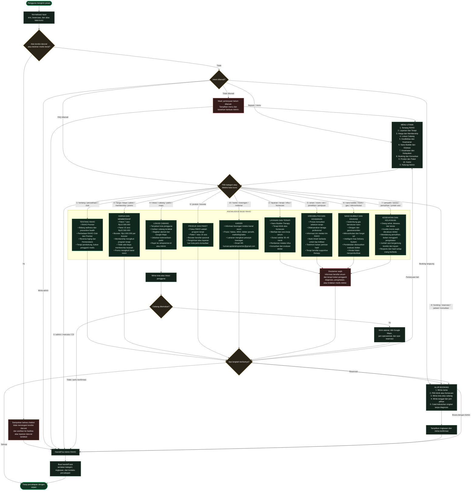

# Alur Chatbot RAHO

Diagram ini merangkum data FAQ dari `Data Google Search.docx` menjadi alur
chatbot WhatsApp bertingkat. Jawaban kesehatan harus bersifat informatif,
tidak mendiagnosis, tidak menjanjikan hasil, dan tetap mengarahkan pengguna
ke konsultasi dokter.

## Aturan routing yang disarankan

1. Nomor menu dan kata kunci natural-language harus mengarah ke intent yang
   sama.
2. Pertanyaan lanjutan tetap membawa konteks kategori sebelumnya.
3. Pertanyaan tentang penyakit atau keamanan tidak boleh menghasilkan
   diagnosis, rekomendasi personal, atau jaminan hasil.
4. Harga, promo, alamat, jadwal dokter, dan jam operasional sebaiknya berasal
   dari data yang dapat diperbarui, bukan teks statis.
5. Jika confidence intent rendah atau pengguna meminta manusia, buat handoff
   ke Admin dengan ringkasan percakapan.
6. Setelah setiap jawaban, selalu sediakan pilihan kembali ke menu, booking,
   atau berbicara dengan Admin.
