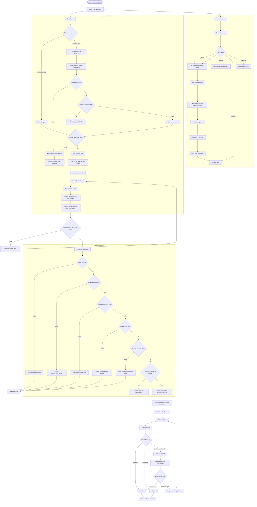
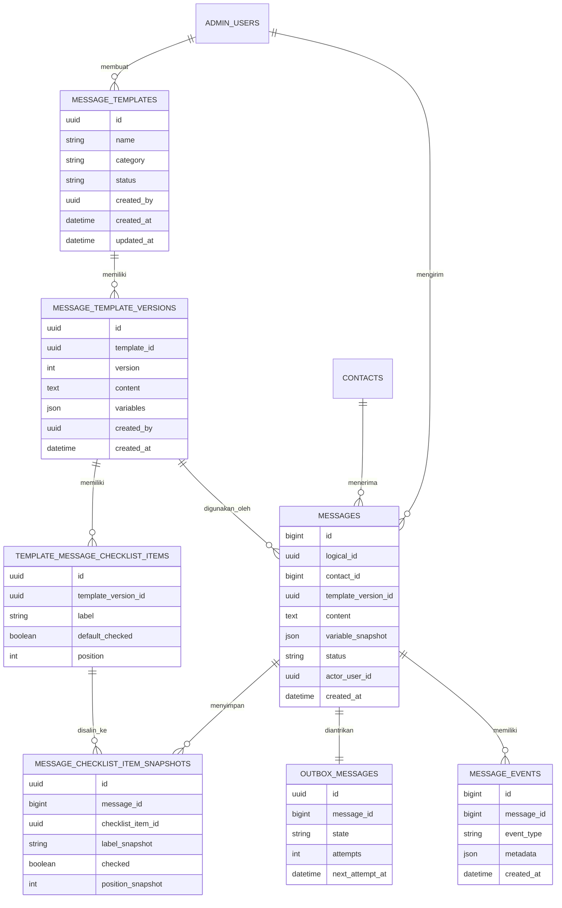

# Requirement Fitur Template Pesan WhatsApp

Status: Draft untuk review sebelum development  
Versi: 1.2  
Tanggal: 6 Agustus 2026

## 1. Tujuan

Menyediakan fitur pengiriman pesan WhatsApp manual yang cepat, aman, dan mudah digunakan melalui template yang dapat disesuaikan. Isi template dapat memiliki variabel dan checklist visual yang statusnya bisa dicentang oleh operator dari control panel sebelum pesan dikirim.

## 2. Ruang Lingkup MVP

- Pengiriman dilakukan ke satu pelanggan dalam satu proses.
- Penerima dapat dipilih dari kontak yang sudah ada atau dimasukkan sebagai nomor WhatsApp manual.
- Template merupakan template internal aplikasi, bukan template resmi WhatsApp Business dari Meta.
- Template dapat disesuaikan sebelum dikirim tanpa mengubah template aslinya.
- Hanya kontak dengan nomor atau JID WhatsApp valid yang dapat dipilih.
- Kontak dan percakapan Playground tidak boleh muncul sebagai penerima WhatsApp.
- Pesan tetap dikirim melalui outbox yang sudah tersedia.
- Broadcast massal belum termasuk dalam MVP.

## 3. Struktur Menu

Tambahkan menu **Kirim Pesan** di sidebar kiri, setelah **Tindak Lanjut** dan sebelum **Kontak**. Ketika menu dibuka, aplikasi langsung menampilkan halaman **Buat Pesan**.

Area fitur memiliki dua halaman:

1. **Buat Pesan**
2. **Kelola Template**

Tombol **Kelola Template** ditampilkan di kanan atas halaman **Buat Pesan**, sehingga sidebar hanya memiliki satu menu baru.

## 4. Kelola Template

Admin dapat:

- Membuat template.
- Mengedit template.
- Menduplikasi template.
- Mengaktifkan dan menonaktifkan template.
- Mengarsipkan template.
- Melihat versi dan riwayat perubahan template.

Setiap template memiliki:

- Nama template.
- Kategori.
- Isi pesan.
- Daftar variabel.
- Daftar checklist.
- Status draft, aktif, nonaktif, atau diarsipkan.
- Nomor versi.
- Pembuat dan pengubah terakhir.
- Waktu dibuat dan diperbarui.

### Contoh template

```text
Halo {{nama_pelanggan}},

Terima kasih sudah menghubungi RAHO.

Berikut informasi yang perlu Anda siapkan:
Dokumen ☐
Nama Partner ☐
Infuse Set ☐
Nomor telepon partner ☐

Salam,
{{nama_admin}}
```

### Variabel MVP

- `{{nama_pelanggan}}`
- `{{nomor_pelanggan}}`
- `{{nama_admin}}`
- `{{tanggal}}`
- `{{informasi_tambahan}}`

Sistem wajib memberikan peringatan jika variabel wajib belum memiliki nilai.

## 5. Checklist di Dalam Pesan

Checklist merupakan bagian dari isi pesan yang dikirim ke pelanggan. Admin dapat menambahkan sebuah **blok checklist** pada posisi tertentu di template, kemudian menambah, menghapus, mengganti nama, dan mengurutkan item di dalamnya.

Untuk MVP, satu template memiliki maksimal satu blok checklist. Ketika Admin menekan **Tambah Checklist**, aplikasi menyisipkan blok tersebut pada posisi kursor. Secara internal posisi blok dapat ditandai dengan marker `{{checklist}}`, tetapi marker teknis ini tidak ditampilkan kepada pengguna pada preview atau pesan WhatsApp.

Contoh tampilan checklist pada aplikasi:

- [ ] Dokumen
- [ ] Nama Partner
- [ ] Infuse Set
- [ ] Nomor telepon partner

Operator dapat mencentang setiap item langsung dari halaman **Buat Pesan**. Setiap perubahan harus langsung diperlihatkan pada preview:

- Item belum dicentang ditampilkan sebagai `☐`.
- Item sudah dicentang ditampilkan sebagai `☑`.

Contoh setelah operator mencentang sebagian item:

```text
Berikut informasi yang perlu Anda siapkan:
Dokumen ☑
Nama Partner ☐
Infuse Set ☑
Nomor telepon partner ☐
```

Setiap item checklist memiliki:

- ID stabil.
- Label.
- Urutan.
- Status awal saat template dipilih.
- Status saat ini: dicentang atau belum.

Checklist tidak berfungsi sebagai pengunci wajib pengiriman. Pesan boleh dikirim dengan kombinasi `☐` dan `☑` sesuai kondisi sebenarnya. Backend wajib menyimpan snapshot label, urutan, dan status setiap item agar riwayat pesan lama tidak berubah ketika template diperbarui.

> WhatsApp biasa tidak menyediakan checkbox yang dapat diklik di dalam pesan teks. Checkbox hanya interaktif di control panel. Pelanggan menerima hasil akhirnya sebagai karakter teks `☐` dan `☑`.

## 6. Alur Pengiriman

1. Operator membuka halaman **Buat Pesan**.
2. Operator memilih metode penerima: **Pilih Kontak** atau **Input Nomor Manual**.
3. Jika memilih kontak, Operator mencari dan memilih pelanggan dari daftar kontak WhatsApp.
4. Jika memilih input manual, Operator mengetik nomor WhatsApp pelanggan.
5. Sistem menormalisasi dan memvalidasi nomor atau JID WhatsApp pelanggan.
6. Jika nomor manual sudah terdaftar, sistem memakai kontak yang sudah ada agar tidak membuat duplikat.
7. Jika nomor manual belum terdaftar, sistem membuat kontak baru setelah nomor dinyatakan valid.
8. Operator memilih template aktif.
9. Sistem menyalin isi, variabel, dan blok checklist template.
10. Sistem mengisi variabel yang tersedia secara otomatis.
11. Operator mengisi variabel tambahan.
12. Operator dapat menyesuaikan isi pesan.
13. Operator mencentang atau mengosongkan item checklist dari aplikasi.
14. Sistem menampilkan preview final menggunakan simbol `☐` dan `☑`.
15. Operator menekan **Masukkan ke antrean**.
16. Backend melakukan validasi ulang.
17. Pesan dan snapshot template disimpan.
18. Pesan masuk ke outbox.
19. Operator dapat melihat status pengiriman.

## 7. Input Nomor Manual

Pada halaman **Buat Pesan**, bagian penerima menyediakan dua pilihan:

- **Pilih Kontak** untuk mencari kontak yang sudah tersimpan.
- **Input Nomor Manual** untuk mengetik nomor baru.

Nomor manual dapat ditulis dalam format umum berikut:

- `081234567890`
- `81234567890`
- `+6281234567890`
- `62 812-3456-7890`

Sistem menormalisasi seluruh format tersebut menjadi format internasional angka saja, misalnya `6281234567890`, kemudian membentuk JID `6281234567890@s.whatsapp.net`.

Ketentuan input nomor manual:

- Hanya menerima nomor dengan panjang 10 sampai 15 digit setelah normalisasi.
- Nomor yang dimulai dengan `0` diubah menjadi kode negara Indonesia `62`.
- Nomor yang dimulai dengan `8` ditambahkan kode negara `62`.
- Huruf dan nomor dengan panjang tidak valid harus ditolak.
- Backend wajib mengulangi normalisasi dan validasi.
- Sistem mencari nomor yang sama di database sebelum membuat kontak baru.
- Jika pemeriksaan akun WhatsApp tersedia, sistem memberi tahu ketika nomor tidak terdaftar di WhatsApp.
- Nama pelanggan bersifat opsional saat membuat kontak melalui nomor manual.
- Preview harus menampilkan nomor yang sudah dinormalisasi dalam bentuk tersamarkan.
- Nomor manual tidak boleh melewati outbox atau aturan keamanan pengiriman yang sudah ada.

## 8. Diagram Alur Mermaid



## 9. Validasi Sebelum Pengiriman

Tombol kirim dan kolom pesan harus dinonaktifkan jika:

- Nomor pelanggan tidak tersedia.
- JID WhatsApp tidak valid.
- Kontak berasal dari Playground.
- WhatsApp tidak terhubung.
- Pengiriman sedang dipause.
- Template tidak aktif.
- Variabel wajib belum diisi.
- Struktur atau status checklist tidak valid.
- Pesan kosong.
- Pesan melebihi 4.096 karakter.
- Pengguna tidak memiliki izin mengirim pesan.

Validasi yang sama wajib dilakukan kembali oleh backend. Validasi UI tidak boleh menjadi satu-satunya pengaman.

## 10. Status Pengiriman

- Draft.
- Siap dikirim.
- Dijadwalkan.
- Masuk antrean.
- Sedang dikirim.
- Terkirim.
- Gagal.
- Hasil belum pasti.

Pesan dengan status **hasil belum pasti** tidak boleh dikirim ulang secara otomatis. Admin harus melakukan reconciliation terlebih dahulu untuk mencegah pesan ganda.

## 11. Hak Akses

### Viewer

- Melihat template.
- Melihat riwayat pengiriman.

### Operator

- Menggunakan template aktif.
- Menyesuaikan pesan.
- Mencentang dan mengosongkan checklist di dalam pesan.
- Mengirim pesan jika memiliki permission `messages.send`.

### Admin

- Seluruh kemampuan Operator.
- Membuat dan mengedit template.
- Mengaktifkan, menonaktifkan, menduplikasi, dan mengarsipkan template.
- Melihat riwayat versi dan audit.

## 12. Struktur Data



## 13. API yang Dibutuhkan

- `GET /api/admin/v1/message-templates`
- `POST /api/admin/v1/message-templates`
- `GET /api/admin/v1/message-templates/:id`
- `PUT /api/admin/v1/message-templates/:id`
- `POST /api/admin/v1/message-templates/:id/duplicate`
- `POST /api/admin/v1/message-templates/:id/activate`
- `POST /api/admin/v1/message-templates/:id/archive`
- `POST /api/admin/v1/message-templates/:id/preview`
- `POST /api/admin/v1/messages`

Endpoint pengiriman pesan yang sudah ada dapat dikembangkan agar menerima:

- Tepat salah satu dari `recipient.contactId` atau `recipient.phone`.
- `templateId`
- `templateVersionId`
- Nilai variabel.
- Daftar item checklist beserta status `checked`.
- Isi final pesan.
- Idempotency key.

## 14. Keamanan dan Audit

- Seluruh endpoint mutasi wajib menggunakan autentikasi, permission, CSRF, dan rate limit.
- Backend wajib memvalidasi kontak dan JID WhatsApp.
- Setiap perubahan template wajib masuk audit log.
- Setiap pengiriman menyimpan operator, versi template, isi final, variabel, serta snapshot label dan status checklist.
- Data sensitif tidak boleh ditulis ke operational log.
- Idempotency key wajib digunakan untuk mencegah pengiriman ganda.

## 15. Acceptance Criteria MVP

Fitur dianggap selesai jika:

- Admin dapat membuat template dengan variabel dan blok checklist di dalam pesan.
- Operator dapat memilih kontak WhatsApp asli.
- Operator dapat memasukkan nomor WhatsApp secara manual.
- Nomor manual dinormalisasi dan divalidasi kembali oleh backend.
- Nomor manual yang sudah terdaftar menggunakan kontak lama dan tidak membuat duplikat.
- Percakapan Playground tidak muncul sebagai penerima.
- Template dapat disesuaikan sebelum dikirim.
- Operator dapat mencentang dan mengosongkan item checklist dari aplikasi.
- Preview mengubah item belum selesai menjadi `☐` dan item selesai menjadi `☑`.
- Pesan WhatsApp yang dikirim menggunakan simbol checklist yang sama dengan preview.
- Preview sama dengan isi final yang disimpan.
- Tombol kirim terkunci jika penerima, variabel, isi pesan, atau struktur checklist tidak valid.
- Backend menolak penerima, variabel, template, atau checklist yang tidak valid.
- Request yang sama tidak menghasilkan pesan ganda.
- Pesan berhasil masuk ke outbox.
- Riwayat menyimpan versi template, nilai variabel, dan checklist.
- Seluruh perubahan dan pengiriman penting tercatat dalam audit log.

## 16. Di Luar MVP

- Broadcast atau campaign massal.
- Import penerima dari Excel atau CSV.
- Template resmi WhatsApp Business yang memerlukan persetujuan Meta.
- Pengiriman attachment menggunakan template.
- Recurring campaign.
- A/B testing template.
- Statistik campaign tingkat lanjut.
- Opt-out otomatis dan segmentasi pelanggan tingkat lanjut.
