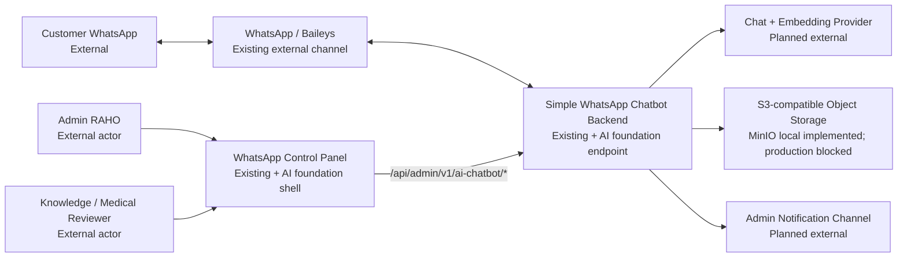
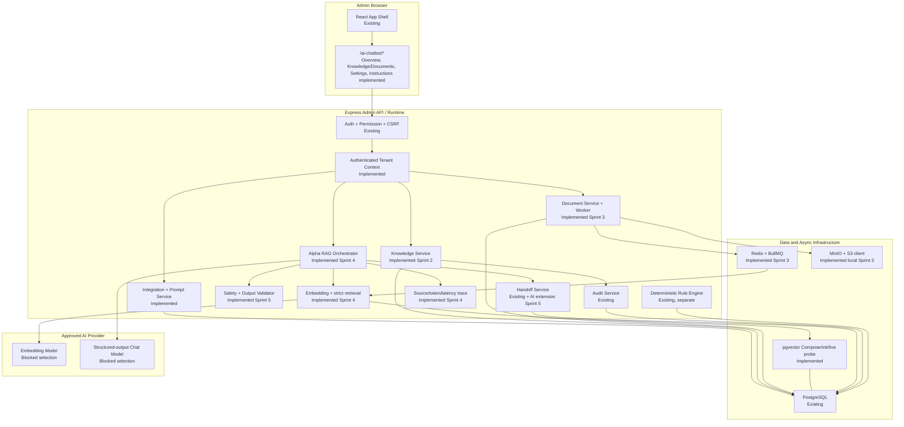
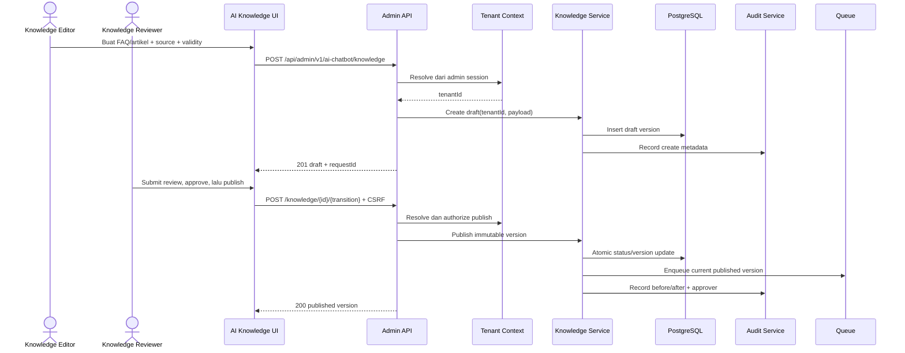
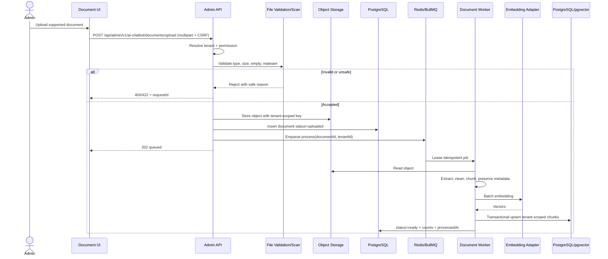
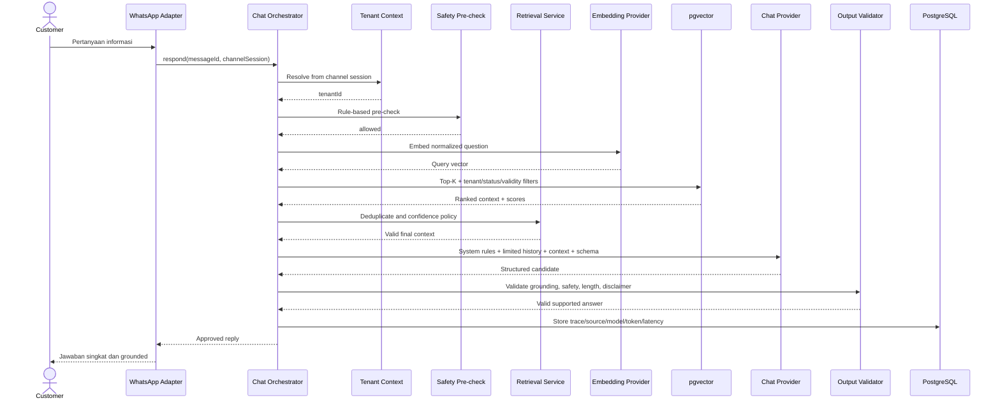
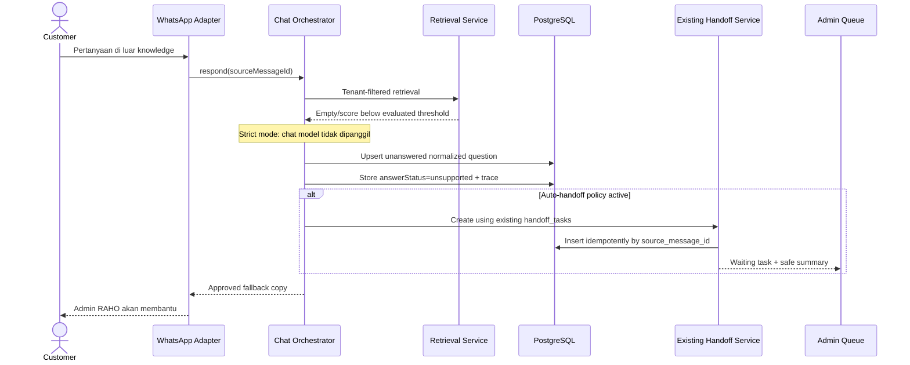

# Architecture — Integrasi Chatbot AI RAHO

## Status dan notation

- **Existing:** tersedia pada codebase saat Sprint 0 dimulai.
- **Planned:** kontrak atau komponen untuk sprint berikutnya.
- **External:** sistem di luar repository.

Diagram adalah target architecture. Keberadaan sebuah node planned bukan bukti
fitur tersebut sudah deployed.

### Implementation snapshot

Implemented sampai akhir Sprint 8:

- sidebar/route shell `/ai-chatbot/*` dan Overview foundation;
- foundation, tenant-scoped integration/readiness, connection-test, dan prompt
  lifecycle API dengan cookie auth, CSRF, audit, serta granular permission;
- environment/config contract dengan AI default-off dan strict grounding;
- stable tenant/membership, integration, dan prompt-version migrations;
- provider/embedding ports dengan deterministic mock dan live dependency probes;
- operational Settings dan AI Instructions UI dengan runtime-validated contracts;
- static development Compose overlay untuk pgvector PostgreSQL, Redis, dan
  MinIO;
- tenant-scoped Knowledge Service, category/FAQ/article CRUD, immutable published
  versions, and draft/review/approved/published/archived lifecycle;
- Knowledge Base UI dengan filter, pagination, editor FAQ/artikel, category
  management, review actions, dan transactional bulk action;
- private document storage, BullMQ queue/worker, extraction/cleaning/chunking,
  deterministic batch embedding, pgvector persistence, retry/reprocess, dan
  token/model/trace usage logs;
- Documents/Processing Queue UI, extraction/chunk preview, published-knowledge
  re-index, dan tenant/status/validity-filtered internal vector search;
- Alpha RAG normalization, query embedding, Top-K/final-context policy,
  strict no-context short circuit, structured generation, output/source subset
  validation, configured fallback, idempotency, dan source/token/latency trace;
- OpenAI-compatible HTTP adapter with server-side environment secret resolver
  plus deterministic local mock;
- admin Alpha RAG Console untuk melihat answer, status, source/score, token,
  latency, model, prompt version, dan trace ID;
- bounded evaluation import/reporting, auditable ten-party evidence gates,
  fail-closed release readiness, sequential requested pilot stages, daily review,
  and emergency pause; effective customer traffic remains hard-off;
- deterministic safety pre-check, emergency/medical/admin/prompt-injection
  short circuit, output claim/leakage validator, disclaimer injection;
- bounded 6–10-message conversation memory, deterministic minimum-fact summary,
  last-topic/knowledge tracking, and cross-session isolation;
- rule/structured interest detection plus atomic idempotent extension of the
  existing handoff queue with reason, priority, summary, safety and trace;
- Safe RAG Console and AI Handoff Queue with assign/in-progress/resolve/close;
- Playground prompt/context simulation, persistent test cases, deterministic
  assertions, bounded batch evaluation, and two-run comparison;
- tenant-scoped Conversation Logs with filters, message/source evidence,
  reviewer feedback, and masked limited CSV export;
- exact-normalized Unanswered Questions aggregation, trace/conversation links,
  review states, and create-draft-FAQ loop;
- tests dan runtime schema untuk seluruh response Sprint 1–6.

Tenant context berasal dari authenticated membership. Integration readiness
memisahkan configured/reachable state dan tetap memaksa
`effectiveEnabled=false`. Safe RAG dapat diuji internal dan service endpoint
tersedia di balik API key + non-production Alpha flag; direct customer WhatsApp
cutover tetap disabled.

## Context diagram



System boundary tetap berupa backend existing. Browser tidak mengakses provider,
database, Redis, object storage, credential, atau WhatsApp socket secara
langsung.

## Container diagram



## Runtime invariants

1. AI default-off; rule engine existing tetap menjadi behavior aktif sampai
   cutover eksplisit.
2. Tenant context selalu dibuat server-side sebelum repository/cache/provider
   call.
3. Knowledge yang belum published, archived, expired, berbeda tenant, atau gagal
   indexing tidak pernah masuk context.
4. Strict mode tidak memanggil chat model bila retrieval tidak mempunyai
   context valid.
5. Provider response harus lolos structured-output parsing dan output validator.
6. Handoff menggunakan existing `handoff_tasks` dan idempotent terhadap source
   message.
7. Booking, pembayaran, diagnosis, dan rekomendasi medis personal tidak ada pada
   orchestration graph.

## Sequence 1 — Knowledge creation dan publication

Status: **Implemented Sprint 3**, termasuk enqueue indexing setelah publish.



API memisahkan `knowledge.edit`, `knowledge.review`, `knowledge.publish`, dan
`knowledge.categories.manage`. Preset role/separation-of-duty final masih
menunggu keputusan Product/Security. Sprint 3 worker memeriksa current published
pointer dan validity saat job berjalan, sehingga versi unpublished, diganti,
archived, atau expired tidak diaktifkan di index.

## Sequence 2 — Document upload dan processing

Status: **Implemented Sprint 3** untuk pipeline internal; production storage,
scanner, sandbox, dan embedding provider masih memerlukan approval.



Extraction/embedding failure menyimpan status `failed` dan safe error, lalu
menyediakan retry; dokumen tidak otomatis menjadi published knowledge.

## Sequence 3 — Supported chat response

Status: **Implemented through Sprint 5** for structured grounding, deterministic
safety validation, bounded memory, disclaimer, trace, and handoff. Final medical
copy/policy approval remains a release gate.



Provider prompt tidak memuat data customer yang tidak diperlukan. Jawaban belum
boleh dikirim sebelum trace persistence/idempotency boundary berhasil sesuai
runtime design Sprint 4.

## Sequence 4 — Low-confidence fallback

Status: **Implemented through Sprint 8**. Unsupported responses are aggregated
exactly, linked to traces/conversations, and can create a draft FAQ. Conservative
embedding-near clustering and manual merge/split remain deferred.



Similarity threshold tidak dikunci pada Sprint 0; nilainya harus berasal dari
evaluation dataset dan dapat berbeda antar embedding model.

## Sequence 5 — Customer interest handoff

Status: **Implemented Sprint 5** with rule/structured interest detection and an
atomic idempotent handoff record.

```mermaid
sequenceDiagram
    actor Customer
    participant WA as WhatsApp Adapter
    participant Orchestrator as Chat Orchestrator
    participant Interest as Interest Detector
    participant Summary as Safe Summarizer
    participant Handoff as Existing Handoff Service
    participant DB as PostgreSQL
    actor CS as Customer Service

    Customer->>WA: Saya tertarik / ingin bicara dengan admin
    WA->>Orchestrator: respond(sourceMessageId)
    Orchestrator->>Interest: Classify using rules/approved model
    Interest-->>Orchestrator: interested=true, reason=customer_interested
    Orchestrator->>Summary: Summarize minimum necessary context
    Summary-->>Orchestrator: Redacted safe summary
    Orchestrator->>Handoff: create(sourceMessageId, reason, summary, priority)
    Handoff->>DB: Reuse handoff_tasks; unique source_message_id
    Handoff-->>CS: Queue item with dueAt when SLA configured
    Orchestrator->>DB: Mark AI conversation interested/handoff
    Orchestrator-->>WA: Approved handoff message
    WA-->>Customer: Admin RAHO akan melanjutkan
```

Handoff hanya mencatat data minimum yang disetujui. Deteksi minat tidak membuat
booking, memilih terapi, atau memberi rekomendasi program personal.

## Failure and degraded behavior

| Failure | Required behavior |
|---|---|
| Tenant tidak dapat di-resolve | Reject; jangan retrieval atau provider call |
| Redis/object storage gagal saat AI nonaktif | AI capability unavailable; core service tetap berjalan |
| Document extraction/embedding gagal | Status failed, tidak searchable, retry tersedia |
| Retrieval kosong/low confidence | Jangan panggil chat model; fallback + unanswered |
| Chat provider timeout/rate limit | Retry terbatas dan idempotent, lalu fallback |
| Structured output invalid | Satu controlled repair bila diizinkan, lalu fallback |
| Validator menolak output | Fallback dan safe internal diagnostic |
| Handoff insert replay | Kembalikan existing task; jangan duplikasi |
| Trace persistence gagal | Jangan melaporkan respons sebagai sukses tanpa runtime policy eksplisit |

## Deployment shape target

```text
local/development
  React + Express + pgvector PostgreSQL + Redis + MinIO + mock provider

staging
  production-like services + approved non-production provider credentials
  + evaluation dataset + no customer traffic

production/pilot
  secret manager + managed PostgreSQL/pgvector + Redis + object storage
  + approved provider + tenant/traffic feature flag + monitoring/alerts
```

Provider, managed infrastructure, CD target, and observability vendor remain
open decisions; therefore this deployment shape is documented, not implemented.
