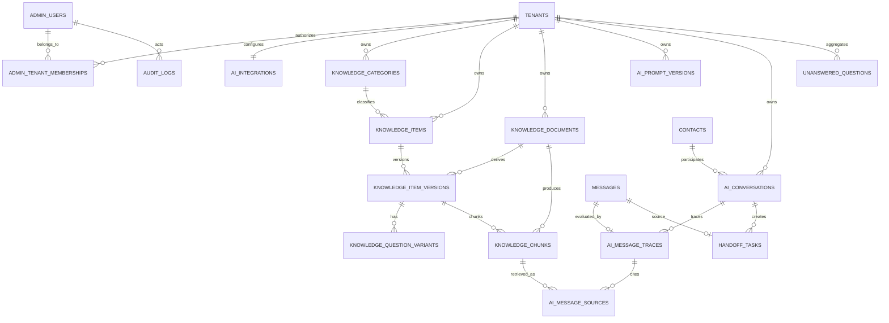

# Logical Data Model — Integrasi Chatbot AI

## Status

Dokumen ini mencatat physical model Sprint 1–6. Struktur Analytics Sprint 7
tetap logical/planned.
Tabel yang berlabel Implemented telah masuk migration idempotent; tabel lain
tetap rencana dan belum boleh diasumsikan tersedia.

Existing tables tetap menjadi source of truth dan tidak boleh dibuat ulang:

- `admin_users` dan `admin_sessions`;
- `contacts` dan `messages`;
- `audit_logs`;
- `handoff_tasks`;
- `chatbot_rule_versions` dan `chatbot_rules` untuk rule engine lama.

Seluruh penambahan harus incremental. Khusus `handoff_tasks`, SQL `CREATE TABLE`
dari blueprint **tidak boleh** dijalankan karena nama tersebut sudah digunakan.

## Conventions

- Primary key baru: UUID, kecuali join/event table yang memang cocok BIGSERIAL.
- Waktu: `TIMESTAMPTZ`, disimpan UTC.
- Tenant: UUID wajib pada seluruh aggregate AI.
- Soft lifecycle: explicit status; delete fisik hanya mengikuti retention/deletion
  policy.
- Published knowledge dan prompt immutable; perubahan membuat version baru.
- Vector dimension ditentukan setelah embedding model disetujui.
- Provider API key tidak berada di database ini; hanya opaque `secret_ref`.
- PII dan message content tidak disalin ke trace bila dapat direferensikan dari
  existing `messages`.

## Logical ERD

Uppercase labels indicate logical entities; physical names use snake_case.

## Tenant foundation

### `tenants` — Implemented Sprint 1

| Column | Type | Constraint/notes |
|---|---|---|
| `id` | UUID | PK; stable RAHO UUID for single-tenant bootstrap |
| `slug` | VARCHAR(100) | Unique, non-secret |
| `name` | VARCHAR(150) | |
| `status` | VARCHAR(30) | `active`, `suspended` |
| `created_at` | TIMESTAMPTZ | |
| `updated_at` | TIMESTAMPTZ | |

### `admin_tenant_memberships` — Implemented Sprint 1

| Column | Type | Constraint/notes |
|---|---|---|
| `tenant_id` | UUID | FK `tenants.id` |
| `admin_user_id` | UUID | FK existing `admin_users.id` |
| `permissions` | JSONB | AI-specific grants during transition |
| `created_at` | TIMESTAMPTZ | |

Primary key `(tenant_id, admin_user_id)`. Browser input never overrides the
tenant resolved from this membership/session.

## Integration settings

### `ai_integrations` — Implemented Sprint 1

| Column | Type | Constraint/notes |
|---|---|---|
| `id` | UUID | PK |
| `tenant_id` | UUID | FK + unique; one active integration per tenant for MVP |
| `name` | VARCHAR(150) | |
| `provider` | VARCHAR(50) | Approved adapter identifier |
| `chat_model` | VARCHAR(100) | |
| `embedding_provider` | VARCHAR(50) | May equal chat provider |
| `embedding_model` | VARCHAR(100) | |
| `embedding_dimensions` | INTEGER | Immutable once indexed data exists |
| `secret_ref` | TEXT | Opaque secret-manager reference, never secret value |
| `is_active` | BOOLEAN | Default `FALSE` |
| `strict_grounding` | BOOLEAN | Default `TRUE` |
| `max_response_tokens` | INTEGER | Validated range |
| `temperature` | NUMERIC(3,2) | Low default, validated `0..1` |
| `timeout_ms` | INTEGER | |
| `retry_count` | INTEGER | Bounded |
| `retrieval_settings` | JSONB | Top-K, context limit; schema validated |
| `feature_flags` | JSONB | Tenant-scoped feature gates |
| `revision` | INTEGER | Optimistic concurrency |
| `created_at` | TIMESTAMPTZ | |
| `updated_at` | TIMESTAMPTZ | |

API responses expose whether a secret reference is configured, never
`secret_ref` or resolved credential.

## Knowledge governance

### `knowledge_categories` — Implemented Sprint 2

| Column | Type | Constraint/notes |
|---|---|---|
| `id` | UUID | PK |
| `tenant_id` | UUID | FK |
| `name` | VARCHAR(150) | |
| `slug` | VARCHAR(150) | Unique with tenant |
| `description` | TEXT | |
| `is_active` | BOOLEAN | Default `TRUE` |
| `sort_order` | INTEGER | Default `0` |
| `revision` | INTEGER | Optimistic concurrency, starts at `1` |
| `created_at` | TIMESTAMPTZ | |
| `updated_at` | TIMESTAMPTZ | |

Unique `(tenant_id, slug)`.

### `knowledge_items` — Implemented Sprint 2

Stable identity only; publishable content lives in version rows.

| Column | Type | Constraint/notes |
|---|---|---|
| `id` | UUID | PK |
| `tenant_id` | UUID | FK |
| `category_id` | UUID nullable | Must belong to same tenant |
| `source_type` | VARCHAR(30) | Sprint 2: `faq`, `article` |
| `current_version` | INTEGER | Latest created version |
| `published_version_id` | UUID nullable | FK after version creation |
| `created_by` | UUID | FK `admin_users.id` |
| `created_at` | TIMESTAMPTZ | |
| `updated_at` | TIMESTAMPTZ | |

### `knowledge_item_versions` — Implemented Sprint 2

| Column | Type | Constraint/notes |
|---|---|---|
| `id` | UUID | PK |
| `tenant_id` | UUID | Redundant by design for safe filtering |
| `knowledge_item_id` | UUID | FK |
| `version` | INTEGER | Unique with item |
| `revision` | INTEGER | Optimistic concurrency for editable draft |
| `title` | VARCHAR(255) | |
| `question` | TEXT nullable | FAQ canonical question |
| `content` | TEXT | Required |
| `source_reference` | TEXT nullable | Approved public/internal reference metadata |
| `internal_notes` | TEXT nullable | Internal-only review notes |
| `tags` | JSONB array | Validated bounded tags |
| `metadata` | JSONB object | Validated bounded metadata |
| `content_fingerprint` | CHAR(64) | SHA-256 normalized content fingerprint |
| `status` | VARCHAR(30) | `draft`, `review`, `approved`, `published`, `archived` |
| `requires_disclaimer` | BOOLEAN | Default `FALSE` |
| `priority` | INTEGER | Bounded |
| `valid_from` | TIMESTAMPTZ nullable | |
| `valid_until` | TIMESTAMPTZ nullable | Must be after `valid_from` |
| `created_by` | UUID | |
| `approved_by` | UUID nullable | |
| `published_by` | UUID nullable | |
| `change_reason` | TEXT nullable | Required for material publish |
| `created_at` | TIMESTAMPTZ | |
| `updated_at` | TIMESTAMPTZ | |
| `approved_at` | TIMESTAMPTZ nullable | |
| `published_at` | TIMESTAMPTZ nullable | |

Unique `(knowledge_item_id, version)`. Published row is immutable to the
application role. Draft/edit and publish permissions must be distinct.

### `knowledge_question_variants` — Implemented Sprint 2

| Column | Type | Constraint/notes |
|---|---|---|
| `id` | UUID | PK |
| `tenant_id` | UUID | Safe tenant filter |
| `knowledge_item_version_id` | UUID | FK |
| `question` | TEXT | Required and normalized for duplicate check |
| `normalized_question` | TEXT | NFKC/lowercase/whitespace normalized; unique per version |
| `created_at` | TIMESTAMPTZ | |

## Documents and vectors

### `knowledge_documents` — Implemented Sprint 3

| Column | Type | Constraint/notes |
|---|---|---|
| `id` | UUID | PK |
| `tenant_id` | UUID | FK |
| `category_id` | UUID nullable | Same-tenant category |
| `original_filename` | VARCHAR(255) | Original bounded display name |
| `sanitized_filename` | VARCHAR(255) | Safe display name |
| `object_key` | TEXT | Tenant-scoped object key; not public URL |
| `mime_type` | VARCHAR(100) | Allowlisted |
| `file_extension` | VARCHAR(10) | `pdf`, `docx`, `txt`, `md`, `csv` |
| `file_size` | BIGINT | Bounded |
| `content_sha256` | CHAR(64) | Deduplication/integrity |
| `processing_status` | VARCHAR(30) | `uploaded`, `queued`, `extracting`, `cleaning`, `chunking`, `embedding`, `ready`, `failed`, `archived` |
| `processing_revision` | INTEGER | Idempotency generation for processing jobs |
| `extraction_preview` | TEXT nullable | Bounded/redacted; full text need not be returned by API |
| `extracted_character_count` | INTEGER | Default `0` |
| `page_count` | INTEGER nullable | Parser-reported pages where available |
| `total_chunks` | INTEGER | Default `0` |
| `attempt_count` | INTEGER | Default `0` |
| `safe_error_code` | VARCHAR(100) nullable | No provider/parser secret |
| `safe_error_message` | VARCHAR(500) nullable | Sanitized operator message |
| `uploaded_by` | UUID | FK admin |
| `created_at` | TIMESTAMPTZ | |
| `updated_at` | TIMESTAMPTZ | |
| `processed_at` | TIMESTAMPTZ nullable | |

Unique `(tenant_id, content_sha256)` prevents duplicate object ingestion for a
tenant. The private object is addressed only by the generated `object_key`.

### `knowledge_chunks` — Implemented Sprint 3

| Column | Type | Constraint/notes |
|---|---|---|
| `id` | UUID | PK |
| `tenant_id` | UUID | Mandatory vector filter |
| `knowledge_item_version_id` | UUID nullable | FK |
| `document_id` | UUID nullable | FK |
| `category_id` | UUID nullable | Same tenant |
| `chunk_index` | INTEGER | Unique per source/version |
| `title` | VARCHAR(255) nullable | |
| `section` | VARCHAR(255) nullable | |
| `content` | TEXT | |
| `content_sha256` | CHAR(64) | Idempotent re-index |
| `embedding` | VECTOR(n) | `n` blocked by model choice |
| `embedding_model` | VARCHAR(100) | Prevent mixed dimensions/models |
| `embedding_version` | VARCHAR(100) | Adapter/index generation |
| `token_count` | INTEGER | |
| `metadata` | JSONB | Schema validated, no credential/PII |
| `status` | VARCHAR(30) | `active`, `inactive`, `failed` |
| `created_at` | TIMESTAMPTZ | |
| `updated_at` | TIMESTAMPTZ | |

Vector search must include `tenant_id`, published version, active status, and
validity predicates before ranking. Index type/parameters are chosen after the
dataset and recall/latency benchmark exist.

### `ai_embedding_usage_logs` — Implemented Sprint 3

| Column | Type | Constraint/notes |
|---|---|---|
| `id` | BIGSERIAL | PK |
| `tenant_id` | UUID | Mandatory audit scope |
| `knowledge_item_version_id` | UUID nullable | Source version, retained as nullable after deletion |
| `document_id` | UUID nullable | Source document, retained as nullable after deletion |
| `embedding_model` | VARCHAR(100) | Adapter model identifier |
| `embedding_version` | VARCHAR(100) | Adapter/index generation |
| `input_count` | INTEGER | Embedded chunk count |
| `token_count` | INTEGER | Approximate/request token usage |
| `estimated_cost_usd` | NUMERIC nullable | Populated only when pricing is configured |
| `trace_id` | VARCHAR(100) | Correlates queue/index execution |
| `created_at` | TIMESTAMPTZ | |

## Prompt versions

### `ai_prompt_versions` — Implemented Sprint 1

| Column | Type | Constraint/notes |
|---|---|---|
| `id` | UUID | PK |
| `tenant_id` | UUID | FK |
| `name` | VARCHAR(150) | |
| `system_instruction` | TEXT | Required |
| `tone` | VARCHAR(50) | |
| `primary_language` | VARCHAR(20) | Default `id` |
| `fallback_message` | TEXT | Required |
| `handoff_message` | TEXT | Required |
| `disclaimer_text` | TEXT nullable | |
| `max_answer_length` | INTEGER | |
| `version` | INTEGER | Unique with tenant |
| `status` | VARCHAR(30) | `draft`, `review`, `approved`, `published`, `archived` |
| `created_by` | UUID | |
| `approved_by` | UUID nullable | |
| `created_at` | TIMESTAMPTZ | |
| `approved_at` | TIMESTAMPTZ nullable | |
| `published_at` | TIMESTAMPTZ nullable | |

At most one published prompt is active per tenant/integration. Published rows
are immutable.

### `ai_safety_policies` — Implemented Sprint 5

| Column | Type | Constraint/notes |
|---|---|---|
| `tenant_id` | UUID | PK/FK; one policy per tenant |
| `policy` | JSONB | Bounded history, controlled messages, and phrase lists; object only |
| `revision` | INTEGER | Optimistic policy version |
| `approved_by` | UUID nullable | Reserved for formal RAHO approval |
| `approved_at` | TIMESTAMPTZ nullable | Null means provisional policy |
| `updated_at` | TIMESTAMPTZ | |

The shipped policy is deterministic and provisional. Medical phrase lists must
be reviewed by RAHO before production customer traffic.

## Conversation trace

### `ai_conversations` — Implemented Sprint 4

This entity stores AI workflow state while existing `contacts` and `messages`
remain the canonical channel history.

| Column | Type | Constraint/notes |
|---|---|---|
| `id` | UUID | PK |
| `tenant_id` | UUID | FK |
| `contact_id` | BIGINT | FK existing `contacts.id` |
| `channel` | VARCHAR(50) | MVP `whatsapp` |
| `channel_session_id` | VARCHAR(150) | Server-derived channel/session scope |
| `status` | VARCHAR(30) | `active`, `handed_off`, `closed` |
| `topic` | VARCHAR(100) nullable | |
| `is_interested` | BOOLEAN | Default `FALSE` |
| `summary` | TEXT nullable | Redacted/minimum necessary |
| `last_knowledge_ids` | JSONB | IDs only, bounded to the last answer |
| `handoff_status` | VARCHAR(30) nullable | Mirrors the active handoff state |
| `summary_updated_at` | TIMESTAMPTZ nullable | Deterministic summary refresh |
| `started_at` | TIMESTAMPTZ | |
| `last_message_at` | TIMESTAMPTZ | |
| `closed_at` | TIMESTAMPTZ nullable | |

One active conversation per tenant/contact/channel/session is enforced. The
maximum inactivity/automatic-close policy remains an open Product decision.

### `ai_message_traces` — Implemented Sprint 4

| Column | Type | Constraint/notes |
|---|---|---|
| `id` | UUID | PK |
| `tenant_id` | UUID | FK |
| `ai_conversation_id` | UUID | FK |
| `source_message_id` | BIGINT | FK existing incoming `messages.id`, unique per processing attempt policy |
| `response_message_id` | BIGINT nullable | FK existing outgoing `messages.id` |
| `integration_id` | UUID | FK |
| `prompt_version_id` | UUID nullable | FK |
| `request_key` | VARCHAR(500) | Unique per tenant; channel/session/provider-message idempotency |
| `answer_status` | VARCHAR(30) | `supported`, `partially_supported`, `unsupported`, `safety_fallback`, `admin_required` |
| `model` | VARCHAR(100) nullable | Null when model not called |
| `provider` | VARCHAR(50) nullable | Null when no provider was called |
| `best_similarity` | NUMERIC(6,5) nullable | |
| `input_tokens` | INTEGER nullable | |
| `output_tokens` | INTEGER nullable | |
| `retrieval_latency_ms` | INTEGER nullable | |
| `provider_latency_ms` | INTEGER nullable | |
| `total_latency_ms` | INTEGER | |
| `validation_status` | VARCHAR(30) | |
| `handoff_required` | BOOLEAN | |
| `requires_disclaimer` | BOOLEAN | Structured-output flag, default `FALSE` |
| `customer_interest` | BOOLEAN | Placeholder signal, default `FALSE` |
| `handoff_reason` | VARCHAR(100) nullable | Final backend handoff reason |
| `safety_category` | VARCHAR(50) | Deterministic pre-check decision |
| `safety_flags` | JSONB | Bounded flag names, not raw provider output |
| `fallback_reason` | VARCHAR(100) nullable | Controlled fallback classification |
| `output_validation_reasons` | JSONB | Deterministic validator failures |
| `interest_confidence` | NUMERIC(4,3) | 0–1 rule/structured signal |
| `history_message_count` | INTEGER | 0–10 bounded memory evidence |
| `trace_id` | VARCHAR(100) | Unique/correlated with request ID |
| `created_at` | TIMESTAMPTZ | |

The table stores metadata, not a second unbounded copy of message content or raw
provider output. Incoming/outgoing content remains in existing `messages`.

### `ai_message_sources` — Implemented Sprint 4

| Column | Type | Constraint/notes |
|---|---|---|
| `ai_message_trace_id` | UUID | FK |
| `knowledge_chunk_id` | UUID | FK |
| `rank` | INTEGER | |
| `similarity_score` | NUMERIC(6,5) | |
| `final_score` | NUMERIC(6,5) nullable | |
| `used_in_prompt` | BOOLEAN | |
| `used_in_answer` | BOOLEAN | Structured output cited this provided chunk |

Primary key `(ai_message_trace_id, knowledge_chunk_id)`.

## Existing `handoff_tasks` extension — Implemented Sprint 5

Existing columns and behavior remain. The following additive columns are live:

| Column | Type | Notes |
|---|---|---|
| `tenant_id` | UUID nullable during backfill | Required after backfill |
| `ai_conversation_id` | UUID nullable | Link AI workflow |
| `ai_message_trace_id` | UUID nullable/unique | One task per AI trace |
| `reason` | VARCHAR(50) nullable | Controlled Sprint 5 reason |
| `priority` | VARCHAR(20) | `normal`, `high` |
| `summary` | TEXT nullable | Redacted context |
| `knowledge_ids` | JSONB | IDs cited by the answer |
| `safety_category` | VARCHAR(50) nullable | Pre-check category |
| `trace_id` | VARCHAR(100) nullable | Operational correlation |

Existing `source_message_id BIGINT UNIQUE`, state, assignee, due time, resolution,
and audit behavior are retained. Migration must backfill before a new non-null
tenant constraint and does not duplicate historical tasks. Existing
`source_message_id UNIQUE` remains the primary idempotency boundary.

## `ai_admin_feedback` — Implemented Sprint 6

Satu feedback aktif per trace dan tenant. Update mengganti feedback sebelumnya
secara audited tanpa menyimpan prompt/provider output kedua kali.

| Column | Type | Constraint/notes |
|---|---|---|
| `id` | UUID | PK |
| `tenant_id` | UUID | Tenant scope |
| `ai_message_trace_id` | UUID | FK; unique bersama tenant |
| `feedback_type` | VARCHAR(30) | correct/incorrect/incomplete/unsafe/wrong_source/too_long/too_promotional |
| `comment` | TEXT nullable | Maksimum ditegakkan API |
| `correct_knowledge_ids` | JSONB | Valid tenant chunk IDs only |
| `suggested_answer` | TEXT nullable | Reviewer suggestion |
| `reviewer_id` | UUID | FK Admin |
| `reviewed_at`, `updated_at` | TIMESTAMPTZ | |

## `unanswered_questions` — Implemented Sprint 6

| Column | Type | Constraint/notes |
|---|---|---|
| `id` | UUID | PK |
| `tenant_id` | UUID | FK |
| `normalized_question_hash` | CHAR(64) | Tenant-scoped aggregation without using raw text as key |
| `sample_question` | TEXT | Retention/access controlled |
| `occurrence_count` | INTEGER | Default `1` |
| `best_similarity` | NUMERIC(6,5) nullable | |
| `nearest_knowledge_ids` | JSONB | IDs only |
| `predicted_category_id` | UUID nullable | Same tenant |
| `status` | VARCHAR(30) | `new`, `reviewing`, `knowledge_created`, `resolved`, `ignored` |
| `first_seen_at` | TIMESTAMPTZ | |
| `last_seen_at` | TIMESTAMPTZ | |
| `reviewed_by` | UUID nullable | |
| `resolved_knowledge_item_id` | UUID nullable | |

Unique `(tenant_id, normalized_question_hash)` provides exact-normalized
aggregation. `unanswered_question_occurrences` links every aggregate to its
tenant-scoped AI trace and originating conversation. Embedding-near clustering
and merge/split remain optional follow-up work; no aggressive grouping is used.

## `ai_test_cases` and `ai_test_case_runs` — Implemented Sprint 6

`ai_test_cases` stores the bounded recent context, selected prompt version,
expected safety category/source chunk IDs/handoff, must-contain, and
must-not-contain assertions. Every source and prompt reference is tenant
validated by the service.

`ai_test_case_runs` stores pass/fail, normalized score, individual boolean
checks, answer status/preview, trace link, reviewer, and run time. Full answer,
retrieval evidence, model, token, and latency remain in the canonical AI trace.
The UI reads the last two runs for before/after comparison; batch execution is
bounded to 100 active cases.

## Audit reuse

Existing `audit_logs` records administrative events such as:

- integration setting changed/activated/deactivated;
- prompt version created/approved/published;
- knowledge created/reviewed/published/archived;
- document uploaded/reprocessed/deleted;
- handoff assigned/resolved;
- admin feedback applied.

Audit before/after payloads must be redacted. Secret reference resolution,
provider API key, raw uploaded file, full prompt context, and unnecessary PII are
forbidden.

## Required indexes and constraints

Minimum planned constraints:

- unique tenant slug and `(tenant_id, category.slug)`;
- one active integration and one published prompt per tenant;
- unique `(knowledge_item_id, version)`;
- tenant included in lookup/vector/cache keys;
- validity check `valid_until > valid_from` when both exist;
- source integrity and idempotency hashes for document/chunk jobs;
- unique trace ID and idempotent source-message processing;
- existing unique `handoff_tasks.source_message_id` retained;
- partial indexes for published/active/valid knowledge;
- timeline indexes for conversation, trace, unanswered, handoff, and audit views.

Foreign-key tenant consistency may require composite unique keys or repository
guards. Repository guards alone are insufficient; integration tests must attempt
cross-tenant reads and writes.

## Migration order

1. Create tenant and admin membership foundation; seed stable RAHO tenant.
2. Create integration and prompt tables, with AI disabled.
3. Create knowledge/category/version tables.
4. Enable `vector` extension only after compatible PostgreSQL image/service is
   verified.
5. Create document/chunk tables with the selected vector dimension.
6. Create AI conversation/trace/source tables.
7. Add nullable columns to existing `handoff_tasks`, backfill, verify, then add
   safe constraints.
8. Add unanswered/analytics structures.

Every migration requires forward verification and a rollback or roll-forward
procedure. Vector model changes must use a new embedding version/index rather
than silently mixing incompatible vectors.

## Retention decisions still open

- Conversation/message and AI trace retention.
- Raw/sample unanswered question retention.
- Extracted text and uploaded object retention.
- Provider request/response diagnostic retention.
- Audit retention and legal hold.
- Customer deletion workflow across PostgreSQL, cache, object storage, and
  provider logs.
